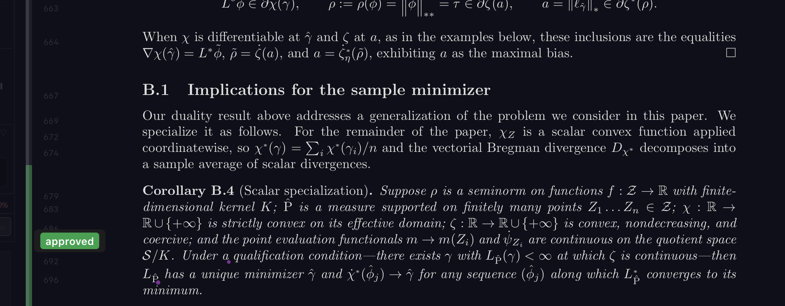
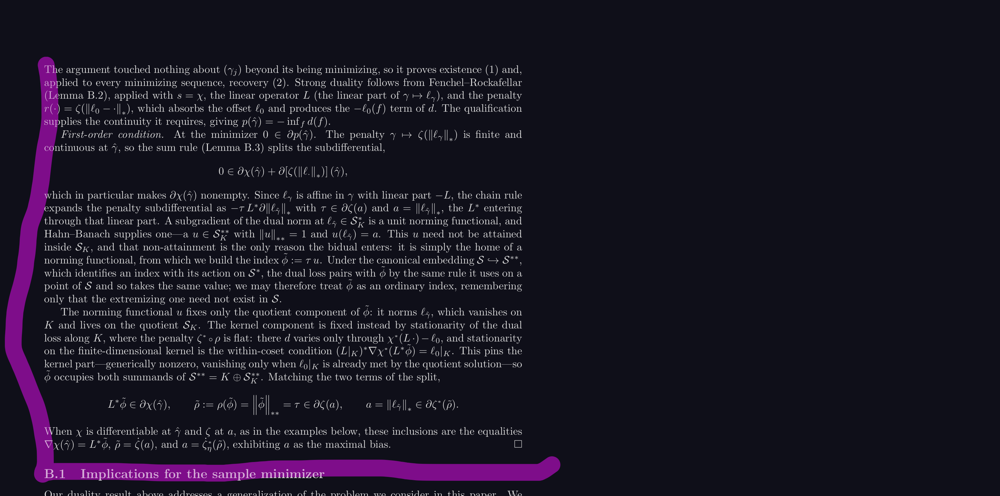
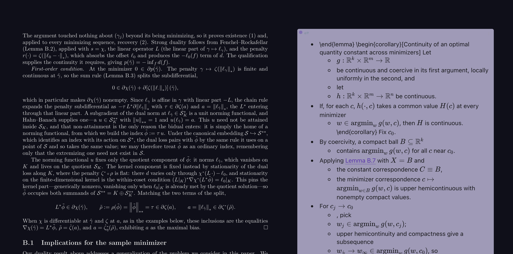
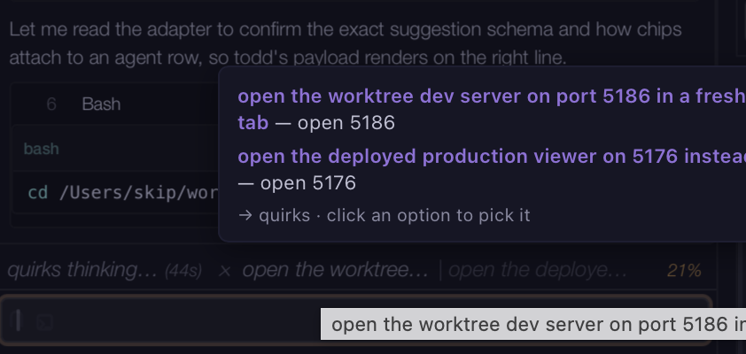
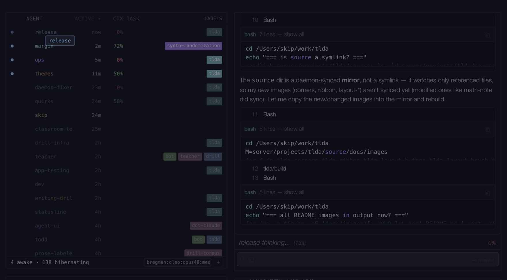
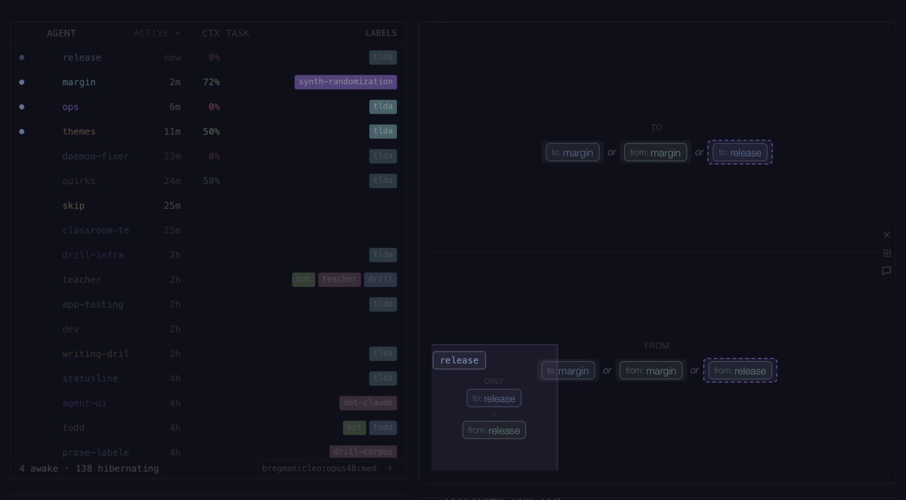
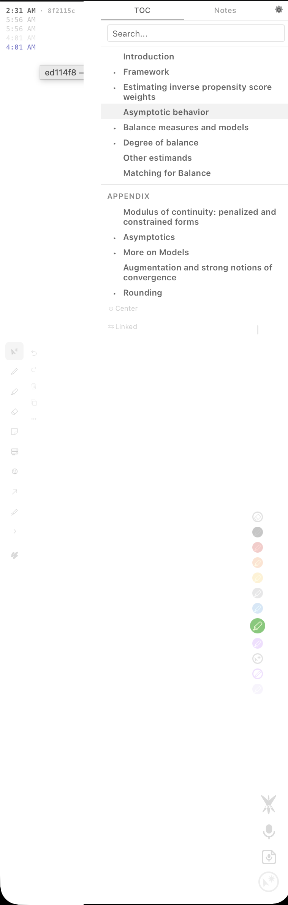
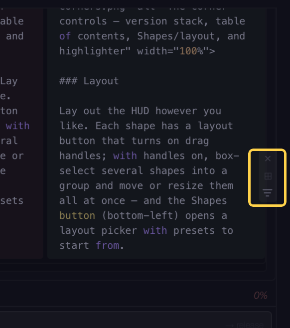
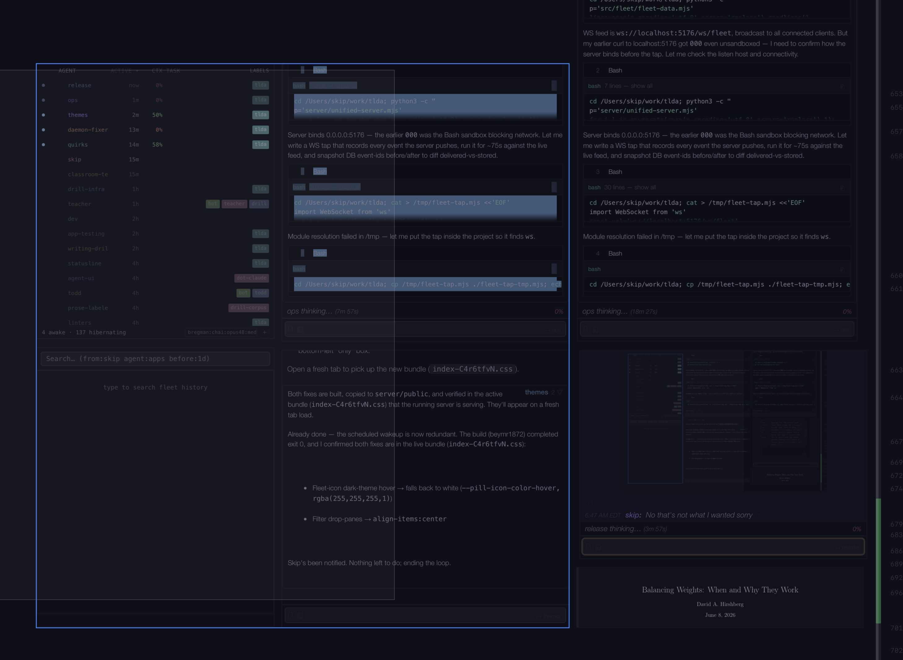

<p align="center">
  
</p>

A shared canvas for reading and writing a LaTeX paper — with the people and AI agents working on it alongside you.

<p align="center">
  
</p>

> **Fair warning:** this whole codebase was vibe-coded with Claude Code. The author has not read the source.

There are really just two things in tlda. There's the **document** — your paper, rendered faithfully from the TeX on an infinite canvas. And there's the **HUD** — the overlay floating over it, whose whole job is to help you read and work on that document. Collaboration runs through both: everyone on the paper — you, your collaborators, and your agents — shares the same canvas and sees the same thing, each in a form that's useful to them.

The rest of this walks through it: getting your paper in, what you do to the document, what the HUD gives you, and how collaboration works.

---

## Getting started

Two ways you end up in tlda: someone is **hosting it for you**, or you're **running your own**.

### Joining someone's tlda

Open the URL they gave you and pick a name — you're on their canvas. Nothing to install.

To put *your own* local agents to work on the paper there, run this in your paper's directory:

```bash
brew tap qtm285/tlda && brew install tlda   # if you don't already have the CLI
TLDA_SERVER=<their-url> tlda config mcp-setup
```

Claude Code in that directory now has tlda's tools, pointed at their server.

To **edit the source yourself** and have your saves rebuild on their canvas, bind a local clone of the paper to the project so your own daemon watches it:

```bash
tlda doc link <name> --dir /path/to/your/clone   # <name> is the project on their server
tlda daemon start                                 # your saves now rebuild there
```

Your clone has to share git history with the paper — otherwise edits won't reconcile. Everyone works in their own clone and syncs with plain git (push, pull, resolve conflicts as usual); the daemon keeps each person's rendered view current but doesn't merge source for you, so reach for a collaborative editor (Zed, VS Code Live Share) when you're in the same file at once.

### Running your own

**Install** — macOS:

```bash
brew tap qtm285/tlda
brew install tlda
brew install --cask mactex-no-gui   # LaTeX — skip if you already have it
```

Linux / manual: install [Node.js](https://nodejs.org/) (v18+) and a TeX distribution with `latexmk` and `dvisvgm` ([TeX Live](https://tug.org/texlive/)), then `npm install -g github:qtm285/tlda`.

Then:

```bash
tlda server start                                        # run when it's down and you want to edit
tlda doc create my-paper --dir /path/to/paper --main paper.tex
tlda config mcp-setup                                    # (in your paper dir) so agents can work on it
tlda doc open my-paper                                   # opens it on the canvas — run once
```

`tlda server start` runs the server and the **daemon** that watches your documents and agents, in the background — start it whenever it's down; while it's up, everything here works. Point `--dir` at an existing git repository on your machine — the daemon picks up your saves and rebuilds, and version history has real history to build on. From there you just edit in your normal editor and the document rebuilds live. `tlda config mcp-setup` gives Claude Code in that directory tlda's tools, so agents can work on the document.

Running `tlda doc open` once opens the doc on the canvas and stores your authorization — from then on you just go back to the page in your browser.

Run `tlda doctor` to check things and `tlda help` (or `tlda doc`, `tlda agent`, …) for commands.

That gets you working on your own machine. To reach it from other devices — your iPad, your collaborators, or hosting it for other people — see [Access & security](#access--security).

> Server on one machine, agents on another? Run `tlda daemon start` on the agents' machine and point it at the server with `TLDA_SERVER`. On a single machine you never need this.

---

## The document

Your paper renders as pages on the canvas and rebuilds live every time you save. This is what you read, annotate, and write. The LaTeX source line numbers show in the margin, so you can see which `.tex` line any passage comes from.

### Annotating

**Sticky notes.** Drop a note anywhere with the note button — or hit the voice-note button to drop one and start dictating straight into it. Notes render KaTeX — `$x^2$` inline, `$$\int_0^1 f(x)\,dx$$` for display — and your paper's own preamble macros just work. They're tied to source lines, so they survive rebuilds and stay put as the document shifts. Agents drop the same notes, including **multiple-choice** questions whose options you answer in one tap, and a note can be **file-backed** — edit the file or the note and the other updates.


**Highlighting.** Click the highlighter button on the bottom-right and drag left to select a highlighter color, or enable the highlighter zone in settings and drag up and down anywhere below the table of contents. Each color carries a meaning — question, notation, expand, cut — shown in a HUD as you pick one. Draw on the page and the text under your stroke is captured, source and all.


**Ribbon.** A comprehension strip down the left edge of each page, just for you. As you read, highlight (or erase) on the ribbon itself to set a passage's status — unchecked through approved — so you can see at a glance what you've actually worked through; erasing returns it to unchecked. The marks are anchored to the source and survive rebuilds, including edits that insert, delete, or split lines.



### Version history

A stack of build timestamps sits in the top-left corner, most recent on top. Click an older one to open that version side by side with the current document, with a slider along the bottom to scrub through the full history; click the current timestamp to close it. Every successful build is committed to a per-project history kept by the server, so the timeline is always complete regardless of your own git habits. Turn on **mirroring** and each build also lands in your own working copy as a tagged git commit — be warned that if you push to your remotes, the history you share will be fine-grained (a commit per build).


### Writing

**Editor integration** — Cmd-click (Mac) or Ctrl-click (Linux) any rendered text to open that exact source line in your editor. Setup once: `tlda config setup editor` (Zed by default; `--editor code`, `cursor`, `nvim`).

**Figures** — reference them the normal way. For vector graphics, write `\includegraphics{plot.pdf}` and provide an SVG that differs only by extension (`plot.svg`); tlda renders the SVG. Raster `.png` / `.jpg` work directly.

**Linters** — tlda runs custom post-build linters you drop in `~/.config/tlda/linters/`: diff-scoped, with findings posted to chat. A simple one ships as an example — it flags new parenthetical asides in your prose. (Write your own; the more opinionated, taste-dependent ones belong in personal config.)

**Scratch workflow** *(experimental)* — revise a passage as a **parallel draft** instead of editing your source in place. To start one, **highlight a passage with the special color at the bottom of the highlighter zone** — that extracts it into a sticky note. The draft renders live in the document alongside the original (it knows the line range it came from), so you watch it iterate; you can view it as raw LaTeX (the actual tex) or — converted from it, with some success — as markdown or an outline. It doesn't auto-replace, though — when you're happy with it, you fold the draft back into your source yourself.

 

---

## The HUD

The HUD is an overlay that sticks with you in the margins of your document — it stays in place as you scroll, and you can pan horizontally to center your view on the document or on your HUD shapes. You can have different shapes on your HUD.

### Chat

Chat is where you talk to your agents and watch what they're doing. It also helps you move around the document: an agent's label renders as a link — hover for a preview of the target, click to pin it, then jump to that part of the document and back.

**A terminal right under chat.** tlda can't replicate everything Claude Code does, and Claude Code changes every couple of days, so the escape hatch lives in the chat's input bar. When the chat is filtered to one agent, a terminal icon appears in the text field: hover it to peek at that agent's live terminal, pin it to keep the pane open, and type into it or interrupt it — without leaving the canvas. (The text field also carries a *magnet* that hard-locks the chat scroll.)


Agents can even wiretap each other — subscribing to notifications on another agent's chat or activity. And any agent can push you **suggestion chips**: small one-tap actions that sit just above the chat input, for the moment an agent needs you to decide rather than a line that scrolls away. They're terse at rest — hover one and it expands to the full action (here, opening a dev server on port 5186, or the deployed viewer on 5176). Tapping one runs its command.



**Dragging.** Almost everything in chat is draggable — that's how you point agents at things. Drag a highlight's context card into chat to ask about that passage, drag a screenshot or image straight from your computer into a message, or drag a past message or card in chat to reference what you or an agent said or did. Whatever you drag in surfaces readably for the agent.

**Filtering.** A chat panel shows whatever matches its filter, and that filter is richer than a single agent: you build it from pills — agents, labels, message roles — grouped with AND and combined with OR, so a panel can show exactly the slice of conversation you want. Scoping a panel to one agent is also what makes its terminal peek available.





**Amending messages.** Two ways to clean up an agent's message after it's sent. **Amend**: agents make mistakes — the canonical one is invalid LaTeX — a linter flags it, and the agent amends its message in place to fix it, rather than sending a follow-up. **Unquote**: one of the most common agent mistakes is backticking a path or label it shouldn't have — you double-click the quoted block and it comes back as if they'd said it without the quotes.

**Interrupting.** With a chat panel focused and filtered to an agent, **Escape** interrupts it, escalating with each press: once for a soft interrupt, twice for a harder one, three times **kills the agent** — it's marked dead, not just hibernated, though you can resurrect it from chat.

### Inbox

Chat is the live firehose; the inbox is its intentional counterpart. It shows just the messages **to and from you**, grouped into per-correspondent threads — you open one on purpose, read it, and its unread clears. When you want to deliberately work through who's said what to you instead of watching everything scroll past, that's the inbox.

### Reference viewer

A standing panel that shows whatever you click — not a static snapshot but a live view of the canvas: you can pan around inside it, annotations show, and it updates in real time. Keep a referenced equation, theorem, or proof in view while you read somewhere else.


### Search

You can scroll a chat panel up indefinitely, or search, to see anything that's happened in the chat history. The search box covers the entire history and renders results as real chat lines — colored names, tool cards, rendered math; combine free text with filters like `from:skip`, `agent:writer`, `before:1d`, and each result opens that conversation inline. Agents reach the same history — their own chat and other agents' — with `search_logs` and `get_thread`.

### Getting around

A few small controls sit in the corners of your canvas. The **bottom-right** holds a small stack — a **highlighter** selector, a **voice-note** button (drops a sticky note and starts dictating into it), a **mic toggle** that turns voice input on and off, and the **Shapes** button, which toggles the HUD on and off when you click it and opens a layout picker when you drag it. A **table of contents** sits largely hidden in the top-right — hover there to reveal it and jump around the document.



### Layout

Lay out the HUD however you like. Click a shape's little **layout button** to get drag handles; from there you can **brush** — drag a box to select other shapes too — then move or resize the whole group at once. The Shapes button (in the bottom-right stack) opens a layout picker with presets to start from.

**Touch and multitouch.** On an iPad or phone the HUD is direct: one finger scrolls the content under it, **two fingers on a panel** move and pinch-resize it at once, two fingers spanning panels move that whole margin group, and **three fingers** anywhere pan the canvas.

 

### Voice

Dictate instead of typing: Right Shift toggles recording, say "send" to dispatch, say "left chat" / "right chat" to switch panels. It's not chat-only — chat, sticky notes, and the terminal are all voice targets.

---

## Collaboration

Here's the idea underneath all of it: everyone — you, your collaborators, and your agents — sees the same information, each in a format useful to them. Every signal is available live to the humans on the canvas *and* to agents through an MCP tool.

- **Where you're looking.** A collaborator sees your cursor move across the document in real time, and can link their camera to yours with a button in the table of contents; an agent gets the same fact — which page and source lines you're on — stamped on every chat message *and* queryable live (`viewing_context`), so it can answer "is this right?" without asking what "this" is.
- **Highlighting.** Everyone can highlight — you with the highlighter, an agent programmatically — and everyone sees them: a collaborator watches you highlight as it happens, an agent subscribes through its `monitor` call.
- **Spawning.** You spawn agents from the agents panel; an agent spawns other fleet agents through its MCP `spawn` tool.

You all talk to anyone in the same chat, about the same document — an agent is just another collaborator. An agent can even screenshot the document anywhere it wants, minimally disruptively, by pulling up its own instance of the reference viewer — which appears briefly in the bottom-left of your screen — and capturing from there, without taking over your view.

### Working with agents

The agents panel on the canvas is the main way to start an agent, see who's awake, and chat with any of them (there's a CLI too, `tlda agent spawn`, for scripting). Agents hibernate after 20 minutes idle instead of dying — send a chat message and a sleeper wakes on its own.

**Two kinds of agent.** Whatever model is driving it, an agent behaves the same on the canvas — but underneath there are two kinds. **Claude** agents (through Claude Code) are the fullest: a real shell, direct file editing, the native skill system. **Sandboxed agents** run any model [OpenRouter](https://openrouter.ai/) supports, or [DeepSeek](https://www.deepseek.com/) directly, on a deliberately narrow surface — the tlda tools are their *only* capability. No shell, no loose filesystem: they edit the paper through a **propose-and-apply** path (propose a diff, then apply it) rather than writing files raw — frankly the easier thing to wire up for a model running outside Claude Code's harness. Either way it's just an agent once it's on the canvas, which is why the rest of this says "agent" without qualification.

**What an agent's engaged.** Both kinds answer to the same **skills** — shared playbooks for how to do a job (writing register, adversarial proof-checking, …) that an agent reads before certain work; which actions require which skills is configurable ([Configuration](#configuration)). Hover an agent's name in chat to see which skills it's **read**, **owes**, or **dismissed**.

### What agents see

Agents don't start from zero — they're situationally aware of you, the document, and each other, without being told.

**Your reading position.** `viewing_context()` returns which document, page, and source lines are in your viewport right now, so an agent can answer "is this right?" without asking what "this" is.

```
viewing_context(user: "fleet:skip")

Document: bregman
Version: a4f975a
Page: 12
Source: main.tex:418-435
Updated: 8s ago
```

**Your annotations.** `read_annotations()` returns your highlights, notes, and pen strokes — each with its source-line position and the text under it.

```
read_annotations("bregman")

bregman — 3 annotation(s)

[highlight] orange L271 main.tex
  ⟦We claim that $\hat\mu$ converges at the parametric rate⟧
  id: shape:Hx7kQ2

[note] violet L420 main.tex
  "Why doesn't this use the tighter bound from Prop 2.1?"
  id: shape:Nq3mR8
```

**Build status and errors.** Agents see when a build starts, succeeds, or fails; on failure, the LaTeX error with a few lines of source context.

**The full chat history.** `search_logs()` and `get_thread()` span every session, context window, and agent lifetime — their own chat and other agents' — so an agent spawned today can read decisions made last week. Results come back as real chat/activity lines with the match highlighted:

```
search_logs("convergence rate")

3 results

6/2, 4:31 PM | [chat] skip → writer | does the **convergence rate** argument still hold after the §3 change?
6/2, 4:33 PM | [chat] writer → skip | yes — the **rate** is unchanged, only the constant moves; updated the remark.
5/30, 9:14 AM | [activity] writer | edited proof.tex:412 — tightened the **convergence** bound
```

**Pending messages.** `my_task()` shows unread messages from other agents:

```
my_task()

📬 Messages:

[from fleet:9ab2e702, id:355048] (reply with chat(to: "fleet:9ab2e702"))
  Update from Skip: all of it goes in the README. One doc, not three.
```

**The document version.** Every message an agent sends is stamped with the build it's reasoning about, so it knows whether the text has changed since its last read.

---

## Bots

Bots can register and talk over chat like any other agent. tlda ships with one example, and you can write your own.

### Todd (included)

**Todd** starts with the server and watches your chat: when it sees an agent drifting, it nudges that agent toward the skill it should be reading before you have to escalate, and offers a one-tap "hand off" / "get qa" chip.

**Handoffs are a Todd feature.** When an agent goes stale — context-poisoned, drifted, or you just want a fresh start — say "hand this off" in chat and Todd spawns a fresh agent, briefed by a separate briefer, that takes over the same name. That name is a *lineage*: the base name carries across hand-offs, the bare name is whoever's working now, and earlier members keep it with a phase suffix — a naming convention we support a little with UI, a sun-or-moon icon marking each member's phase so the family reads as one.

**Markdown versioning is opt-in.** Todd can keep a version history of the markdown your agents share. When an agent shares a `.md` file in chat, Todd copies its current contents into a dedicated git repo and commits, tagging the commit with the chat message id — so you get a timeline of every shared draft, lined up with the conversation. It's off until configured; add an `mdVersions` block to `~/.config/tlda/config.json`:

```json
"mdVersions": {
  "enabled": true,
  "repoDir": "~/work/md-versions",
  "folders": ["~/work/my-paper", "notes"]
}
```

`folders` lists the directories whose markdown to version — each an absolute path or a bare name resolved under `~/work`; shares from anywhere else are ignored. `repoDir` is the git repo Todd writes into (create it once with `git init`). With the block absent, Todd does nothing here. The same block also drives `md-versions/bin/mirror-md.sh`, a companion script that checkpoints all markdown on a cadence and mirrors it (plus the chat DB, session logs, and shadow repos) to cloud storage via [rclone](https://rclone.org/).

### Writing your own

A bot connects through `@tlda/client` (auth, doc assets, staging annotations) and runs its lifecycle on `@tlda/bot` (register, reconnect, pidfile, addressed-command dispatch) — both shipped in this repo. For a full worked example that lives as its own external project, see **[teacher](https://github.com/davidahirshberg/teacher-bot)**: a bot that drills agents on *how they conduct themselves* against a real in-progress paper, built entirely on those two packages.

---

## Sharing & hosting

```bash
tlda doc share my-paper
```

prints a shareable URL with your read-only token embedded — anyone with it can view and annotate. It detects [Tailscale](https://tailscale.com/) and [Tailscale Funnel](https://tailscale.com/kb/1223/funnel) automatically, so you get a network-reachable URL instead of `localhost` when one's available.

### Hosting it for others

You can run tlda on a box other people reach — an always-on machine at home, a VPS, a container host — so they just open a URL and join (the "Joining someone's tlda" path above). It's the same as running your own, with two additions: put a **boundary** around it (next section), and point clients at the server's URL rather than `localhost` by setting `TLDA_SERVER` (and `TLDA_FLEET_SERVER`) to that URL.

<details>
<summary>Worked example: a container host behind Tailscale</summary>

This is roughly how the project's own deployment runs — a container that joins a private [Tailscale](https://tailscale.com/) network and serves only over it:

- Run the server in a container (Node + a TeX distribution for builds; the SPA is served from the same process, so it's one origin — no separate static host).
- Inside the container, bring up `tailscaled` with an auth key (supplied as a secret), then `tailscale serve` the app over the tailnet's HTTPS. Don't expose a public port.
- Set `TLDA_FLEET_SERVER` to the container's tailnet name so clients resolve chat/agents to it, and `TLDA_NO_AUTH=1` (the tailnet is the boundary — see below).
- Mount a volume for the mutable data (`projects/`, `data/`, the fleet database) so it survives redeploys.

Anyone you add to the tailnet opens the `.ts.net` URL and they're in; nobody else can reach it at all.

</details>

### Access & security

tlda runs **real terminals** on the server — that's remote code execution by design. So the server has to sit behind a boundary. Pick one:

- **Network-gate it (recommended).** Put it on a private network — [Tailscale](https://tailscale.com/), a VPN, or a reverse proxy that authenticates — and run the app open inside it with `TLDA_NO_AUTH=1`. There are no tokens to manage; the network *is* the boundary. This is how the project's own deployment runs — it leans on battle-tested network crypto instead of an auth layer we'd have to get right ourselves.
- **Token-gate it.** `tlda config auth init` generates a read token and an RW token; the server then requires a token on every request, and `tlda doc share` hands out URLs with the read token embedded. Use this if you want to expose a port directly without a private network.

On `localhost` you need neither — your own machine is the boundary, and with no tokens configured the app simply runs open locally. The **one thing not to do** is expose the standard port to the internet with no tokens *and* no network boundary: that's an open terminal for anyone who finds it.

## Configuration

Everything persistent lives in `~/.config/tlda/` — your `config.json` (server URL, tokens, default model for new agents), logs, and linters. Set values with `tlda config set server …` / `tlda config set spawn-mode …`.

**Environment variables** override the config file and are how you configure a hosted server:

| Variable | What it does |
|----------|--------------|
| `TLDA_SERVER` | The server clients and the daemon talk to (doc assets, builds). Overrides `config.json`. |
| `TLDA_FLEET_SERVER` | Where clients resolve fleet chat / agents / activity — set this to your server's URL when hosting. |
| `TLDA_NO_AUTH=1` | Run the app open (no per-request token). Use only when the server is behind a network boundary. |
| `TLDA_TOKEN_READ` / `TLDA_TOKEN_RW` | The read / read-write tokens, when token-gating instead of using `config.json`. |
| `DEEPGRAM_API_KEY` | Enables server-side voice transcription (the [Deepgram](https://deepgram.com/) bridge) for everyone on the server. |
| `PORT` | The port to serve on (default `5176`). A non-default port also disables auth, for dev/worktree servers. |

**Skill gating.** Which actions require an agent to read a skill first is itself configuration: `~/.claude/qualifications.json` maps tools and file types to required skills — editing a `.tex` file asks for the writing skills, proposing an edit or sending a report asks for the matching ones. Claude agents are held to it by their harness; sandboxed agents the same way, at the tlda-tool boundary. Point `TLDA_QUALIFICATIONS_FILE` elsewhere to use a different map.

## Third-party licenses

This project uses the [tldraw SDK](https://tldraw.dev) under the [tldraw license](https://tldraw.dev/legal/tldraw-license). The viewer works fine on `localhost` — local use and collaboration over Tailscale/LAN are unaffected. For public deployments you'll need a [tldraw license key](https://tldraw.dev/get-a-license/plans) (free hobby tier available). Heads-up: without one, trying to host it throws red error bars of varying height in the console and then the screen goes white — with nothing to tell you the license is the cause. It is, not a bug in your setup.

## License

[MIT](LICENSE)
