<p align="center">
  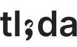
</p>

A collaborative workspace for reading and writing LaTeX documents with AI agents and human collaborators. Renders your compiled paper exactly as it would appear in published form, on a shared canvas where everyone — humans and agents — can annotate, highlight, chat, and point at things in real time.

<p align="center">
  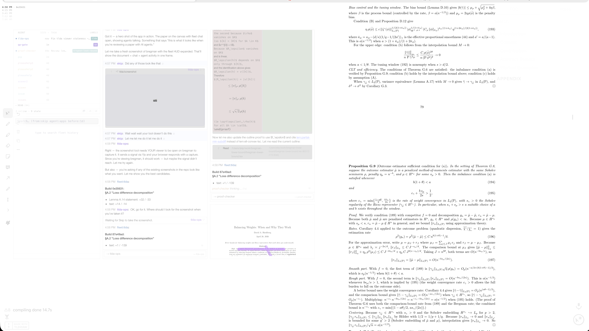
</p>

> **Fair warning:** This entire codebase was vibe-coded with Claude Code. The author has not read the source.

## Why this exists

When an AI agent writes faster than you can read, the bottleneck isn't production — it's verification. You need to stay oriented in a document that changes between readings, verify proofs that reference equations scattered across 40 pages, and communicate with agents about specific passages without losing your place.

tlda puts everything in one space. Your paper renders as high-fidelity SVG pages on an infinite canvas. Chat with agents lives in the margin, right next to the text you're discussing. When an agent mentions an equation, you hover the label and see it rendered in a floating window — no page-flipping. When you highlight a passage, the agent reads the text under your stroke. When you want to see what changed, a timeline scrubber shows diffs with per-change triage (keep, revert, discuss).

The canvas is shared. Collaborators and agents see each other's annotations as they appear. No AI required — it works just as well for reading any paper with a friend. Most papers on arXiv have TeX source available.

## What it looks like

Your paper renders as high-fidelity SVG pages on the main canvas. It rebuilds live when you save. Chat, notes, and agent activity live on the same canvas — position them wherever you want.

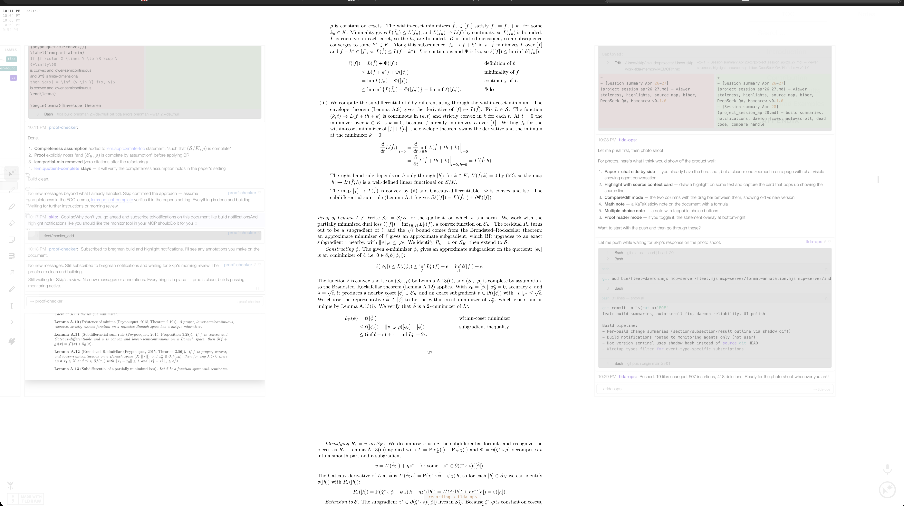

**Labels are links.** Hover a reference to preview the result in a floating viewer. Click to open it. Navigate to the target page, then return.

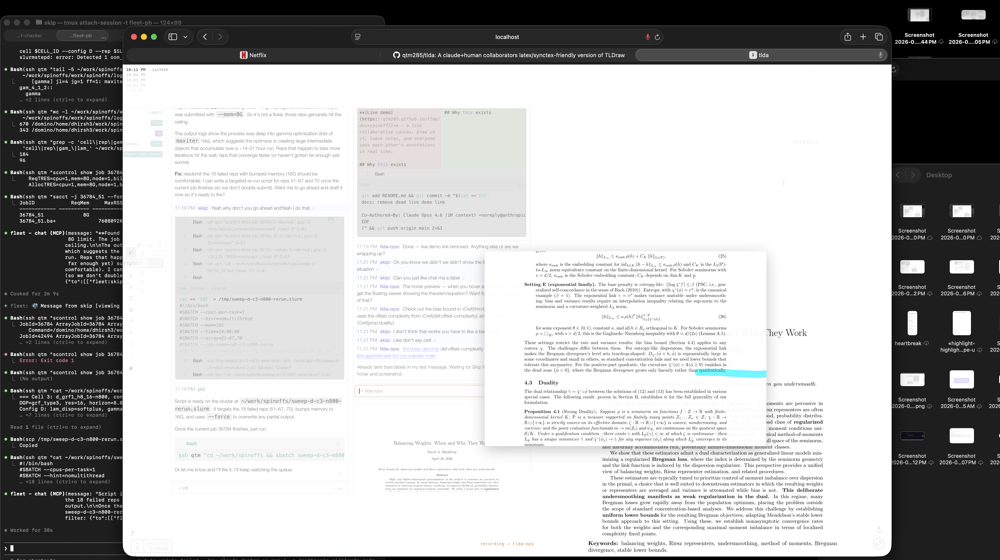 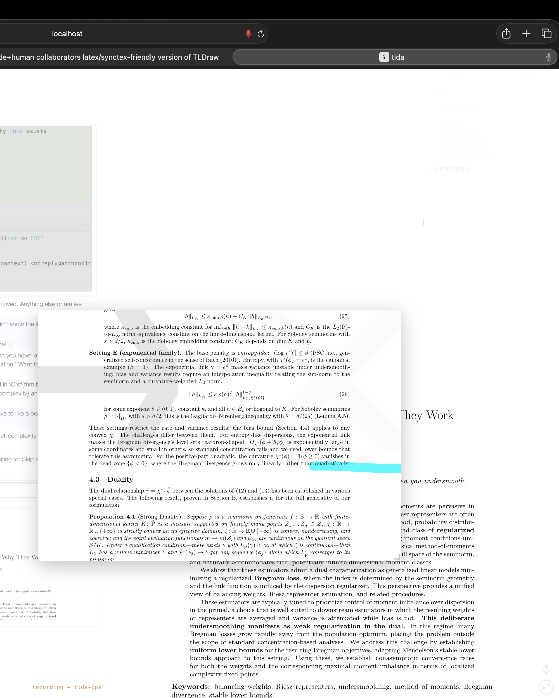
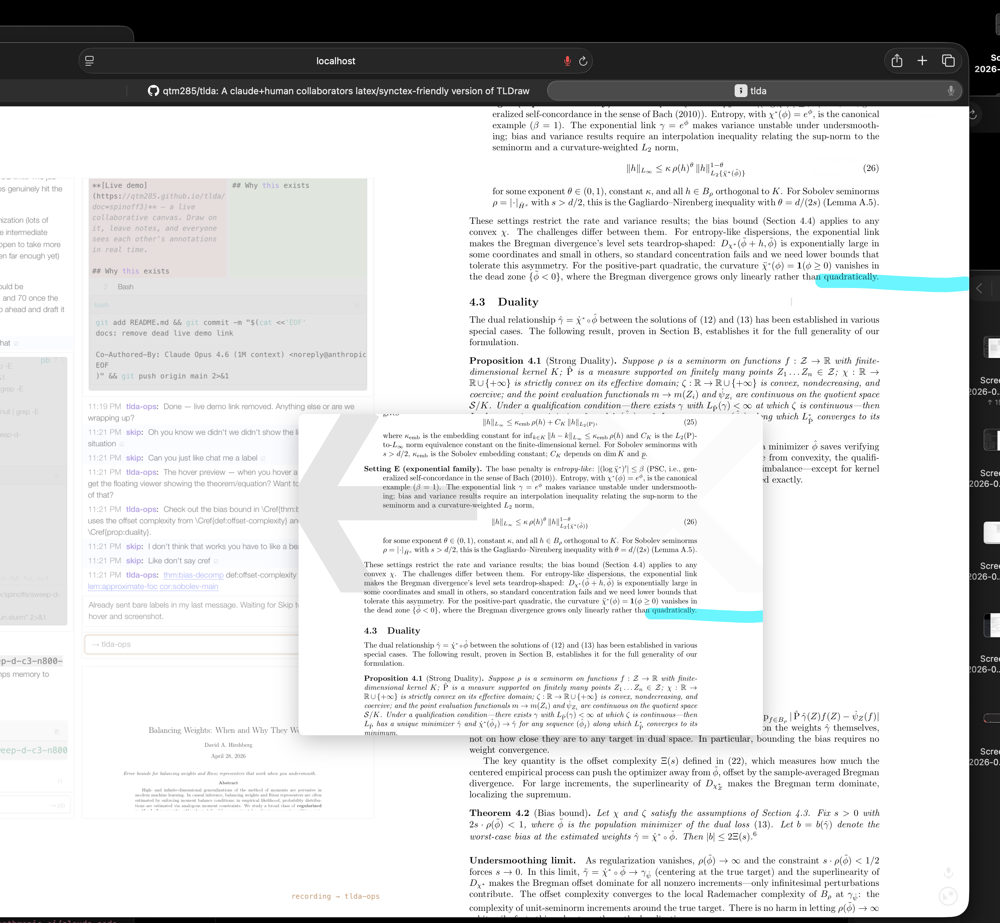 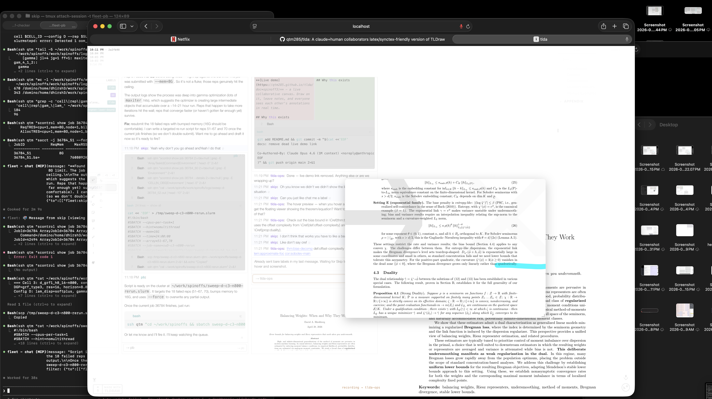

**Highlighting is semantic.** Draw on the page and agents read the text under your stroke. A source context card shows the LaTeX source.

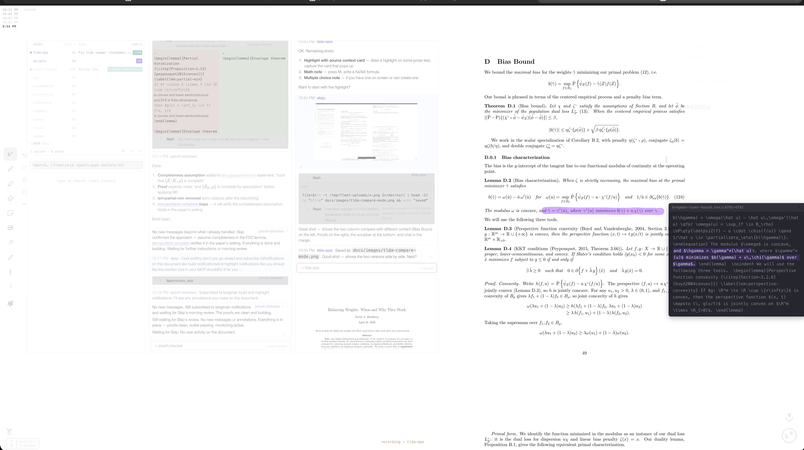

**Multiple-choice notes.** Agents drop questions with tappable options — your selection syncs back immediately.

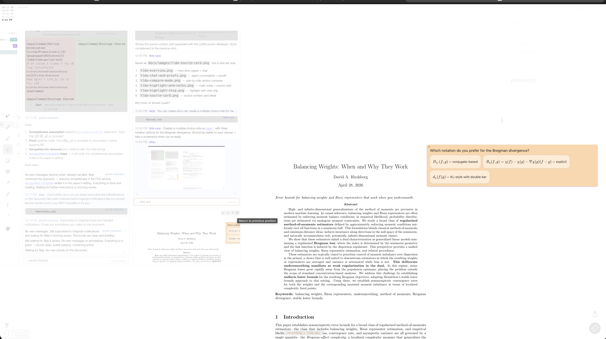

## Key features

- **Source-anchored annotations** — notes are tied to source lines via synctex, so they survive rebuilds and recompilations
- **Reference viewer** — double-click any `\ref` or `\eqref` to see the target inline. Arrow buttons step through references; go-there jumps to the target page
- **Proof reader** — scroll into a proof and a panel shows the theorem statement, plus panels for referenced definitions and lemmas from other pages. No flipping back and forth
- **Build errors on the page** — LaTeX errors appear anchored to the source line where they occur, clickable to open in your editor
- **Editor integration** — Cmd-click any rendered text to open the source at that line (Zed, VS Code, etc.)
- **Voice input** — speak into chat; Chrome transcribes and fills the textarea. Domain-specific vocabulary (Greek letters, math terms, author names) is auto-corrected
- **Real-time sync** — everything syncs over WebSocket. Open on your laptop and iPad simultaneously

## Setup

### macOS (Homebrew)

```bash
brew tap qtm285/tlda
brew install tlda
brew install --cask mactex-no-gui   # LaTeX — skip if you already have it
```

That's it. `tlda` is now on your path. Run `tlda doctor` to confirm everything is working.

### Linux / manual

Install [Node.js](https://nodejs.org/) (v18+) and a TeX distribution with `latexmk` and `dvisvgm` ([TeX Live](https://tug.org/texlive/)), then:

```bash
npm install -g github:qtm285/tlda
```

### Quick start

```bash
tlda config init                                   # generate auth tokens (one time)
tlda server start                                  # start the server
tlda create my-paper --dir /path/to/paper --main paper.tex
tlda watch-all start                               # live rebuild on save
tlda open my-paper                                 # open the viewer for this doc
tlda open                                          # open the index (lists all docs)
```

`tlda config init` generates a read-write token (for you) and a read-only token (for sharing). Your tokens are stored in `~/.config/tlda/config.json` and used automatically.

To share with a collaborator: `tlda share my-paper` prints a URL with the read-only token embedded. Anyone with that URL can annotate but cannot control the presentation.

Run `tlda doctor` to check that all dependencies are installed and the server is healthy.

## Working with agents

tlda integrates with [Claude Code](https://docs.anthropic.com/en/docs/claude-code) via an MCP server. In your paper directory, run:

```bash
tlda mcp-setup
```

This writes `.mcp.json` so Claude Code can see tlda's tools. Open Claude Code in that directory and the `tlda` and `fleet` tool sets are available. Agents can:

- See your highlights, pen strokes, and pings
- Drop anchored notes and multiple-choice questions on the document
- Read the text you're pointing at
- Scroll the viewer to specific locations
- Monitor for new annotations in the background
- Read and edit your LaTeX source, run builds, do deep math checking

Chat messages from agents appear in the margin alongside the document. You can talk to them via voice or text, and they respond in the same space — with rendered math, clickable labels, and inline diffs of their edits.

### Fleet: managing multiple agents

Fleet is the coordination layer for running multiple Claude Code agents simultaneously. Each agent runs in its own tmux session with a persistent identity — you can talk to them, delegate tasks, and see what they're doing.

Agents are spawned using `tlda spawn`, which creates a named Claude Code session in tmux:

```bash
tlda spawn proof-writer                            # respawn an existing agent (resume session)
tlda spawn --fresh reviewer --cwd /path/to/paper   # spawn a brand new agent
tlda spawn --fresh writer --model claude-opus-4-6   # specify a model
```

Each agent gets its own tmux session (`fleet-<name>`) that persists across restarts — `tlda spawn reviewer` without `--fresh` resumes where that agent left off. Identity, MCP registration, and session management are handled automatically.

From within any agent's session, agents can coordinate using fleet MCP tools:

- **`chat()`** — send messages to other agents or the user
- **`delegate()`** — assign a task to another agent with tracking
- **`spawn()`** — start new agents from within a session
- **`wiretap()`** — listen in on conversations between other agents
- **`monitor_add()`** — subscribe to document changes (annotations, builds)

The fleet HUD in the viewer shows all active agents, their current activity (tool calls, file edits), and lets you chat with any of them. Click an agent's name to filter the chat to that conversation.

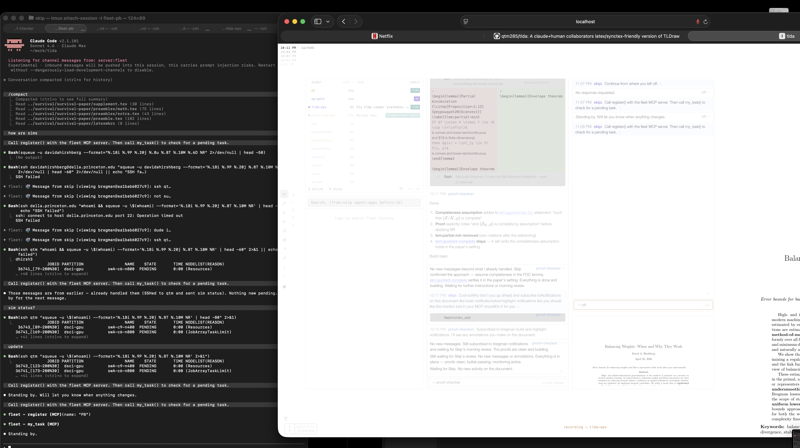

## Sharing

`tlda share my-paper` prints a shareable URL with your read-only token embedded. Anyone with that URL can view and annotate. It checks for Tailscale and Tailscale Funnel automatically — if either is running, you get a network-reachable URL instead of localhost. If neither is set up, it explains how to get there.

## Viewer controls

The primary interface is touch/stylus — keyboard shortcuts exist but aren't required.

**Ping** — tap the small circle in the bottom-right corner to get an agent's attention. Captures a screenshot and your viewport.

**Highlighter** — 11-color slider on the right edge. On iPad, double-tap with stylus to switch colors. On desktop, click the dots.

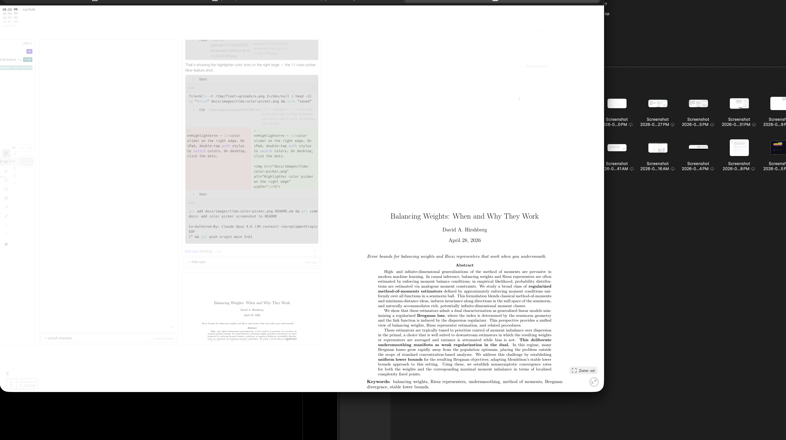
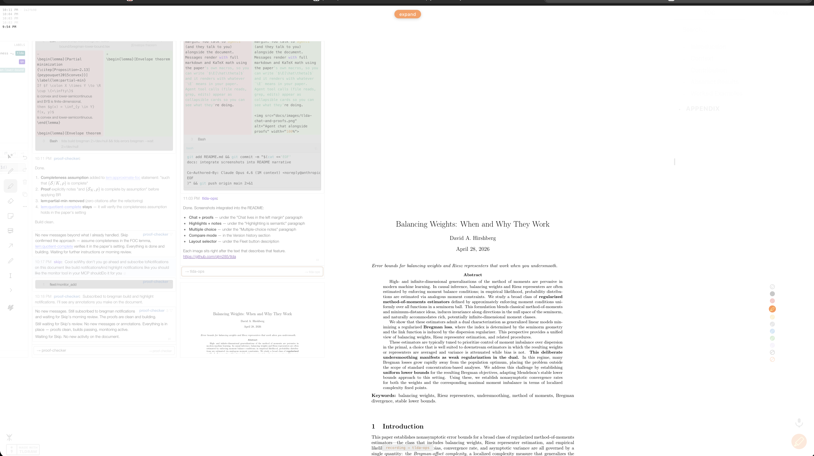

**Panel** — expandable side panel (top-right) with table of contents and notes list.

**Fleet button** — the "Fleet" label in the bottom-left corner controls agent annotation overlays. Click to toggle fleet shapes (agent notes, highlights, arrows) on or off. Click and drag to the right to open the layout picker, which has two presets: all shapes in the left margin, or shapes spread across both margins. You can reposition shapes freely; the presets are just a way to snap back to a known arrangement.

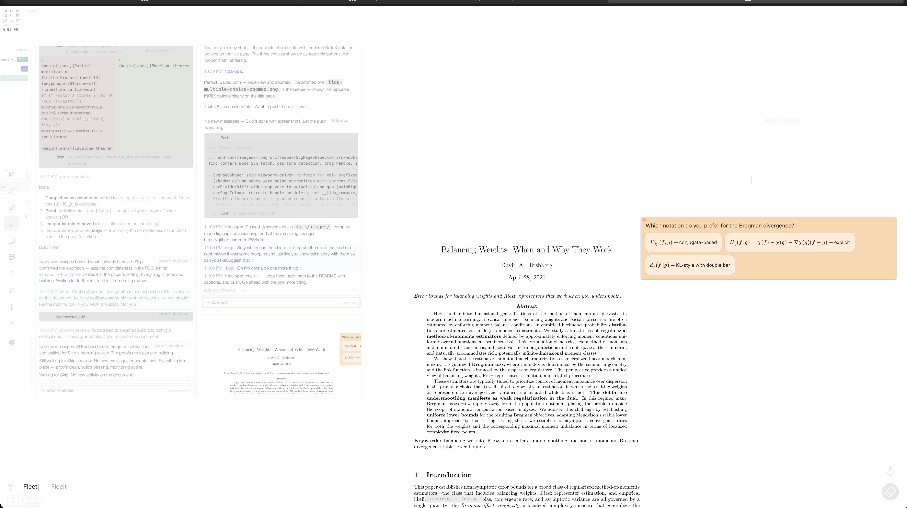
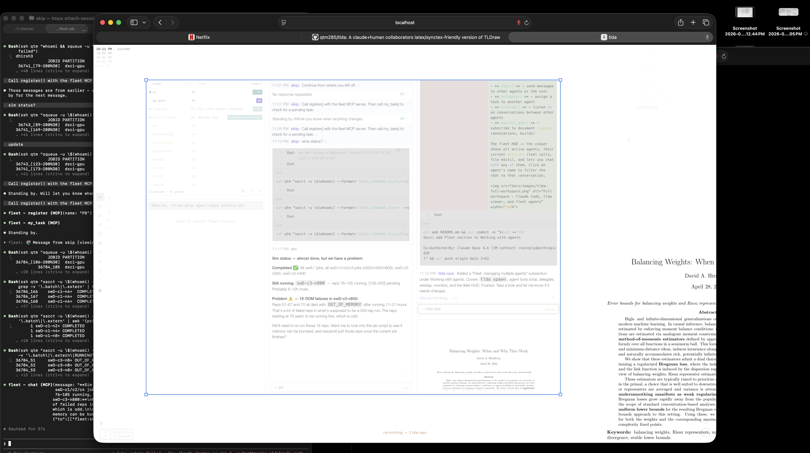
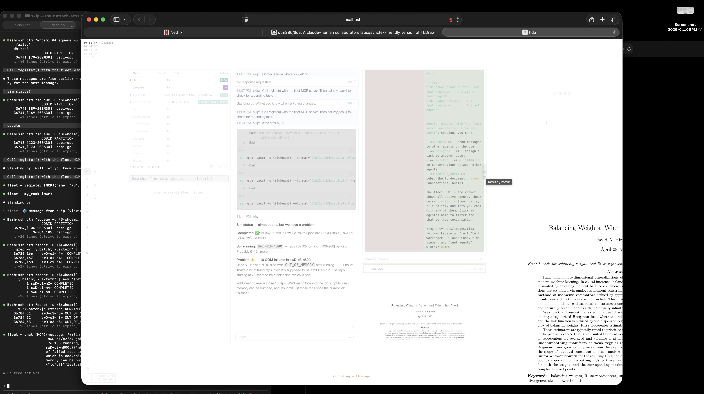

## Version history

A small stack of build timestamps sits in the top-left corner of the canvas. The most recent build is at the top; up to five recent versions are shown, fading out toward the bottom.

Click any older timestamp to open a history column to the right of your document — the paper as it was at that build, side by side with the current version. A slider appears at the bottom of the screen to scrub through your full build history.

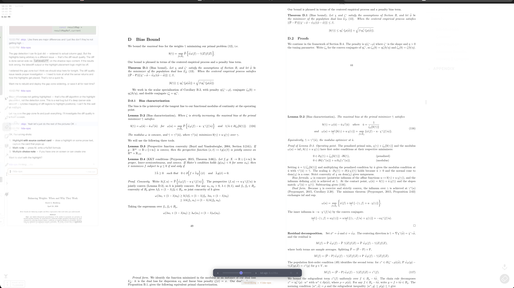

A gray divider bar appears between the two columns. Drag it left or right to move the columns closer together; drag it up or down to vertically align the text between them. Word-by-word diffs are highlighted inline — additions in green, deletions in red.

Click the current (top) timestamp to dismiss the history column.

## Voice input

Voice lets you dictate into chat instead of typing. It uses Chrome's built-in Web Speech API — no external services, no API keys.

**Right Shift** controls everything:

| Taps | Action |
|------|--------|
| 1 | Toggle recording on/off |
| 2 (quick) | Soft reset — restart the speech engine |
| 3 (quick) | Nuclear reset — restart Chrome entirely |

A small dot appears next to the HUD status text while recording: green means audio is flowing, amber means no audio is detected (the system is auto-recovering in the background).

**Voice commands:** Say "send" at the end of a message to send it automatically. Say "right chat" or "left chat" to switch between visible chat panels.

### Voice notes

While recording, tap the voice note button in the toolbar to drop a math note on the canvas. The note appears under your cursor and shows the live transcript as you speak — drag it to position it while you dictate. Tap anywhere to commit it in place. The note enters edit mode immediately and recording continues, so you can keep speaking without touching anything. ESC cancels and removes the ghost.

**Vocabulary:** Chrome's speech recognition doesn't know math terminology, so voice.mjs post-processes the transcript. Greek letters ("phi", "theta"), author names ("Donoho", "Sobolev", "Bregman"), and domain terms ("RKHS", "AMLE", "estimand") are auto-corrected from Chrome's guesses. You can add custom replacements with `addVocabReplacement(pattern, replacement)`.

**Browser support:** Works in Chrome and Safari. For local transcription without any browser dependency, tlda supports [whisper-stream](https://github.com/ggerganov/whisper.cpp) — see `tlda server start` (auto-starts the whisper bridge if installed).

## Figures

LaTeX runs in DVI mode, so `\includegraphics` produces placeholder boxes that get patched with actual images.

**Supported:** `.svg` (preferred), `.png`, `.jpg`, `.eps`

**For PDF figures:** provide an SVG with the same basename and dimensions. If your LaTeX says `\includegraphics{plot.pdf}`, the pipeline uses `plot.svg` instead.

## CLI reference

| Command | What it does |
|---------|-------------|
| `tlda config init` | Generate auth tokens (run once) |
| `tlda server start` | Start the server (port 5176) |
| `tlda server stop` | Stop the server |
| `tlda create <name> --dir /path` | Create a project, push files, build |
| `tlda push [name]` | Push source files, trigger rebuild |
| `tlda watch-all start` | Watch all projects for changes, auto-rebuild on save |
| `tlda open [name]` | Open viewer for a doc; omit name to open the index |
| `tlda list` | List projects |
| `tlda status [name]` | Show build status |
| `tlda errors [name]` | Show LaTeX errors/warnings |
| `tlda share [name]` | Print shareable read-only URL (Tailscale/Funnel aware) |
| `tlda mcp-setup` | Write `.mcp.json` for Claude Code integration |
| `tlda doctor` | Health check + dependency verification |
| `tlda config set <key> <val>` | Persistent configuration |
| `tlda delete <name>` | Delete a project |

Configure with `tlda config set server <url>` or the `TLDA_SERVER` environment variable.

## Other formats

LaTeX is the primary format. tlda also supports:

| Format | Command |
|--------|---------|
| **Markdown** | `tlda create notes --format markdown --dir /path` |
| **HTML** (Quarto) | `tlda create book --format html --dir _book-tlda` |
| **Slides** (reveal.js) | `tlda create deck --format slides --dir /path` |

## Third-party licenses

This project uses the [tldraw SDK](https://tldraw.dev) under the [tldraw license](https://tldraw.dev/legal/tldraw-license). The viewer works fine on `localhost` — local use and collaboration over Tailscale/LAN are unaffected. For public deployments, you'll need a [tldraw license key](https://tldraw.dev/get-a-license/plans) (free hobby tier available).

## License

[MIT](LICENSE)
