<p align="center">
  
</p>

A collaborative workspace for reading and writing LaTeX documents with AI agents and human collaborators. Renders your compiled paper exactly as it would appear in published form, on a shared canvas where everyone — humans and agents — can annotate, highlight, chat, and point at things in real time.

<p align="center">
  
</p>

> **Fair warning:** This entire codebase was vibe-coded with Claude Code. The author has not read the source.

## Why this exists

When an AI agent writes faster than you can read, the bottleneck isn't production — it's verification. You need to stay oriented in a document that changes between readings, verify proofs that reference equations scattered across 40 pages, and communicate with agents about specific passages without losing your place.

tlda puts everything in one space. Your paper renders as high-fidelity SVG pages on an infinite canvas. Chat lives alongside the text you're discussing. Hover a label to preview the target inline. Highlight a passage and agents read the text under your stroke. When you want to see what changed, a timeline scrubber shows diffs inline.

The canvas is shared — collaborators and agents see each other's annotations as they appear. No AI required; it works just as well for reading any paper with a friend. Most papers on arXiv have TeX source available.

## What it looks like

Chat, notes, and agent activity live on the same canvas as your paper. Everything rebuilds live when you save.


### Labels are links

When an agent mentions a label in chat, it renders as a clickable link. Hover to see a preview of the target. Click to pin the preview in place — arrow buttons appear so you can navigate to the target page and back.

 
 

### Highlighting is semantic

To activate highlighting, grab the highlighter button in the bottom-right corner and drag it up — this opens the highlighter zone on the right edge. Put your cursor down in the zone and drag to select a color, eraser, or other tool. Each color has an assigned meaning — question, notation, expand, cut, etc. — shown in a HUD when you select a color.

 

Draw on the page and agents read the text under your stroke. A source context card pops up showing the LaTeX source and the text you selected. Drag the card to a chat panel to share it as a chip, or agents can subscribe to highlight notifications to see them automatically.

 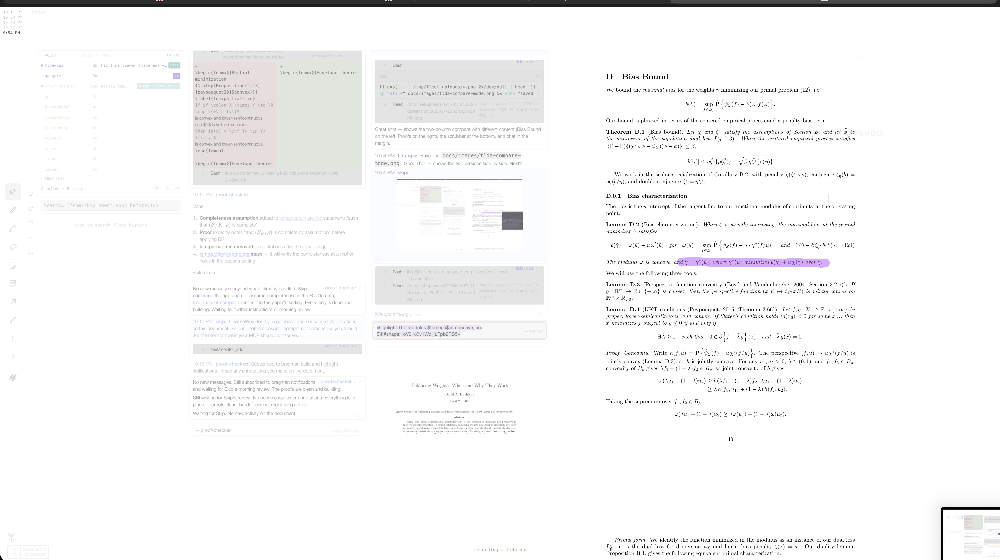

### Multiple-choice notes

Agents drop questions with tappable KaTeX-rendered options. Your selection syncs back immediately.


### Math notes

Click the note button in the toolbar to drop a sticky note on the canvas. Notes support KaTeX: `$x^2$` for inline math, `$$\int_0^1 f(x)\,dx$$` for display math. Custom macros from your paper's preamble are automatically available.

When an agent shares a markdown file by saying its path (not in backticks — those are for quoting), you get a chip in chat that you can drag onto the canvas to create a math note. Notes appear in compact form as a dot — click the dot to see the full note, click the note to edit.

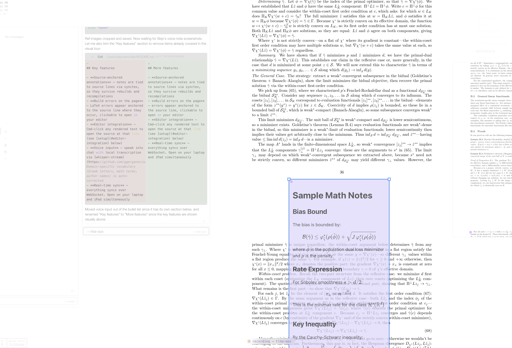 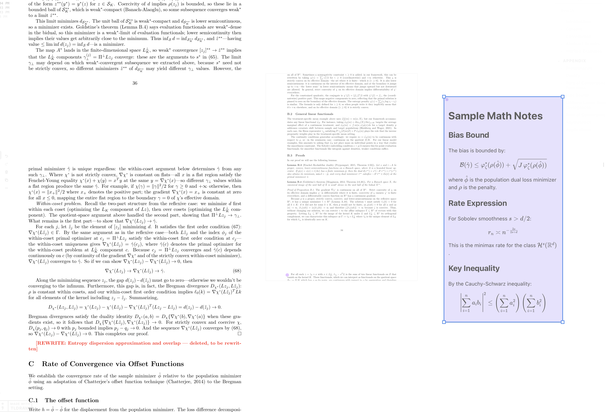

### Doc view

A floating panel on the canvas that auto-shows relevant context from elsewhere in the document. Click a cross-reference and the panel shows the target — before and after:

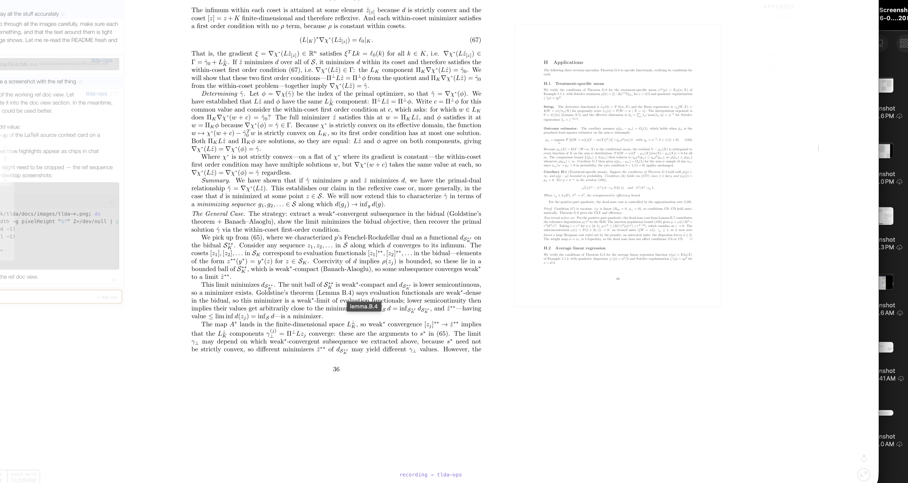 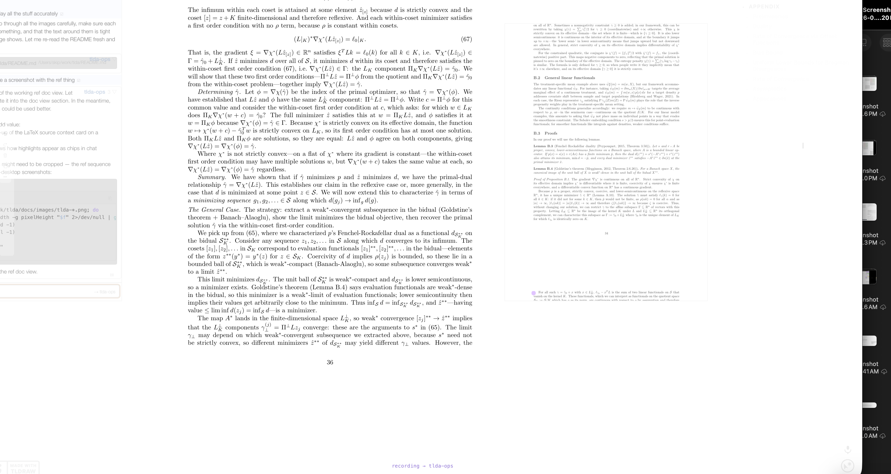

The panel subscribes to configurable *sources*:

- **ref** — click a `\ref` or `\eqref` and the panel shows the target (equation, theorem, figure) so you can read it without leaving the current page.
- **proof** — scroll into a proof and the panel shows the theorem statement from wherever it appears in the document.
- **errors** — when a build fails, the panel jumps to the error location.

## More features

- **Source-anchored annotations** — notes are tied to source lines via synctex, so they survive rebuilds and recompilations
- **Build errors on the page** — errors appear anchored to the source line, clickable to open in your editor
- **Editor integration** — Cmd-click any rendered text to open the source at that line (see [setup](#editor-integration) below)
- **Real-time sync** — everything syncs over WebSocket. Open on your laptop and iPad simultaneously

## Setup

### macOS (Homebrew)

```bash
brew tap qtm285/tlda
brew install tlda
brew install --cask mactex-no-gui   # LaTeX — skip if you already have it
```

That's it. `tlda` is now on your path. Run `tlda doctor` to confirm everything is working.

### Linux / manual

Install [Node.js](https://nodejs.org/) (v18+) and a TeX distribution with `latexmk` and `dvisvgm` ([TeX Live](https://tug.org/texlive/)), then:

```bash
npm install -g github:qtm285/tlda
```

### Quick start

```bash
tlda config init                                   # generate auth tokens (one time)
tlda server start                                  # start the server
tlda create my-paper --dir /path/to/paper --main paper.tex
tlda open my-paper                                 # open the viewer for this doc
tlda open                                          # open the index (lists all docs)
```

`tlda config init` generates a read-write token (for you) and a read-only token (for sharing). Your tokens are stored in `~/.config/tlda/config.json` and used automatically.

To share with a collaborator: `tlda share my-paper` prints a URL with the read-only token embedded. Anyone with that URL can annotate but cannot control the presentation.

Run `tlda doctor` to check that all dependencies are installed and the server is healthy.

## Working with agents

tlda integrates with [Claude Code](https://docs.anthropic.com/en/docs/claude-code) via an MCP server. In your paper directory, run:

```bash
tlda mcp-setup
```

This writes `.mcp.json` so Claude Code can see tlda's tools. Open Claude Code in that directory and the `tlda` and `fleet` tool sets are available. Agents can see your highlights, drop anchored notes and questions on the document, read the text you're pointing at, monitor for changes, and edit your LaTeX source directly.

You talk to agents via voice or text in chat panels that live on the canvas. They respond in the same space — with rendered math, clickable labels, and inline diffs of their edits.

**Unquote:** Agents often share file paths or URLs in backticks. Double-click any inline code span in a chat message to expand it — a path like `` `scratch/fig.png` `` becomes an inline image, and a `` `https://...` `` becomes a link. Relative paths are resolved against the agent's working directory.

### Fleet: managing multiple agents

Fleet is the coordination layer for running multiple Claude Code agents simultaneously. Each agent runs in its own tmux session with a persistent identity.

```bash
tlda spawn proof-writer                            # respawn an existing agent (resume session)
tlda spawn --fresh reviewer --cwd /path/to/paper   # spawn a brand new agent
tlda spawn --fresh writer --model claude-opus-4-6   # specify a model
```

Each agent gets its own tmux session (`fleet-<name>`) that persists across restarts — `tlda spawn reviewer` without `--fresh` resumes where that agent left off.

Agents coordinate using fleet MCP tools: `chat()` to message each other or you, `delegate()` to assign tasks, `spawn()` to start new agents, `wiretap()` to listen in on other conversations, and `monitor_add()` to subscribe to document changes.

The fleet HUD in the viewer shows all active agents, their current activity (tool calls, file edits), and lets you chat with any of them. Drag an agent's name onto a chat panel to filter to that conversation.

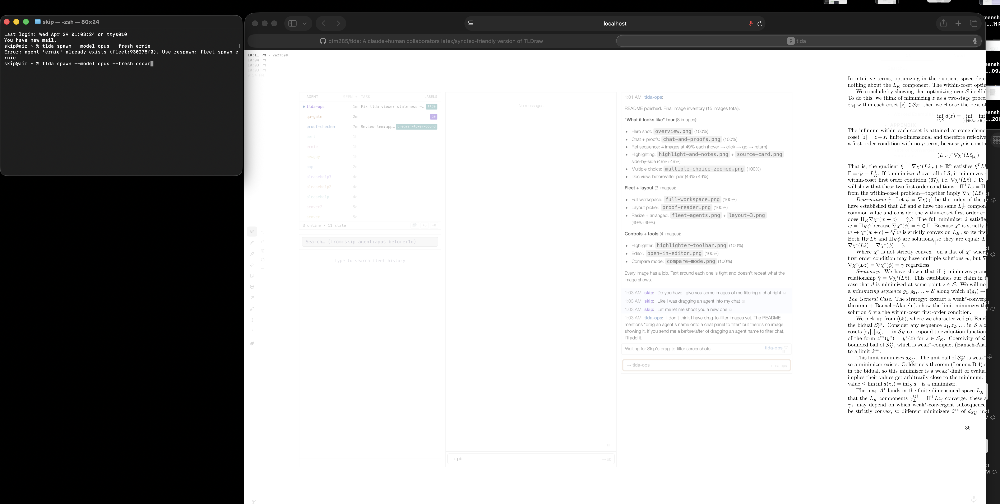

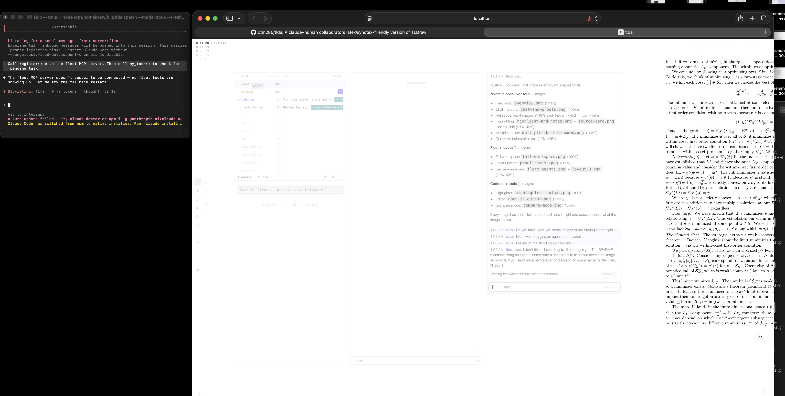 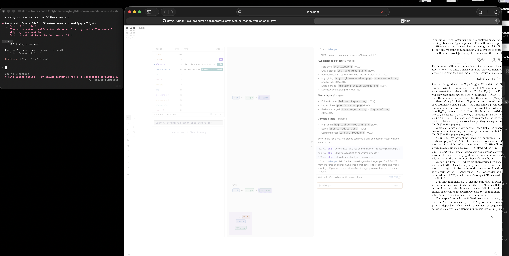

### Eliza: automated agent coaching

Eliza is a lightweight pseudo-agent (`bin/eliza.mjs`) that watches your outgoing chat messages and sends corrective nudges to agents when it detects frustration signals. It's a pure regex decision tree — no LLM, no latency, just pattern matching → chat dispatch. Auto-starts with `tlda server start`.

**How it works:**

When you send a message to an agent, eliza scans it for trigger phrases. On a match it sends the agent a directive (referencing the relevant skill) before you have to escalate.

| Trigger phrase | What eliza sends |
|----------------|-----------------|
| "does that make sense" | Reflect back before proceeding |
| "slow down" | Read `partner-not-soloist` |
| "cop-out" | State the precise claim, prove it step by step |
| "I'm struggling" | Slow down, be more explicit |
| "you don't understand" | 🛑 STOP — reflect back, don't propose solutions |
| "that's useless" | Ask what's needed instead |
| "rude" | Read `partner-not-soloist` + `respond-before-acting` |
| "hurtful" / "feel stupid" | 🛑 Full stop — acknowledge, listen |
| "I'm not talking to you until" | Meet the stated condition first |
| "bro" / "wtf" (standalone) | Re-read CLAUDE.md, say what went wrong |

**Education tracking:**

On re-fire (after a cooldown), eliza checks whether the agent invoked the referenced skill since the last nudge. If they did, the message says "you read it but the pattern is recurring." If they didn't, it says "you were nudged X minutes ago and still haven't read it."

**Cooldowns:** 60 seconds by default, 120 seconds for "does that make sense" (high false-positive rate). Only one trigger fires per message.

**Qualification rules** (`~/.claude/qualifications.json`):

The fleet daemon watches every agent's tool calls. When an agent tries to edit a file without having Read the required prerequisite files, it fires a warning to you in chat. Example config:

```json
{
  "rules": [
    {
      "edit": "**/*.tex",
      "requires": ["~/.claude/reference/math-implementation.md"]
    }
  ]
}
```

Skill invocations (via the `Skill` tool) are tracked alongside file reads — you can require `"skill:partner-not-soloist"` as a prerequisite just like a file path.

### Chat controls

**Scroll to bottom:** When you've scrolled up in a chat panel, a ↓ button appears in the bottom-right corner of the log. Click to jump to the latest messages.

**Terminal peek:** When a chat panel is filtered to a specific agent, a small terminal icon appears in the input bar. Hover to peek at the agent's live tmux output — this shows the current tool call, file being read, or shell command in real time. Click to pin the pane open so it stays visible. The pane has a `^C` button to send an interrupt and a text input to type commands directly into the agent's terminal.

**Interrupting an agent:** With the chat input focused and filtered to an agent (their name chip in the input bar), pressing Escape interrupts the agent. Three escalating tiers:

| Presses | Action |
|---------|--------|
| 1×Esc | Soft interrupt — sends Escape to the tmux session |
| 2×Esc | Hard interrupt — sends a forceful interrupt signal |
| 3×Esc | Kill session — tmux kill-session; agent dies immediately |

### Arranging the canvas

Fleet shapes (agent notes, chat panels, highlights) can be arranged however you want. The **Fleet** button in the bottom-left corner toggles them on or off. Click and drag it to the right to open the layout picker with two presets: all shapes in the left margin, or shapes spread across both margins.


Each shape has a layout button — click it to get drag handles. With drag handles active, drag a box around multiple shapes to select them as a group. Drag the group to reposition all your shapes at once, or resize the bounding box to rescale them together. The presets are just a way to snap back to a known arrangement.

 

## Sharing

`tlda share my-paper` prints a shareable URL with your read-only token embedded. Anyone with that URL can view and annotate. It checks for Tailscale and Tailscale Funnel automatically — if either is running, you get a network-reachable URL instead of localhost.

## Viewer controls

The primary interface is touch/stylus — keyboard shortcuts exist but aren't required.

**Panel** — expandable side panel (top-right) with table of contents and notes list.

## Editor integration

Cmd-click (Mac) or Ctrl-click (Linux) on any rendered text to open the source file at that line in your editor. Highlight cards also have an edit button (✎) that does the same thing.

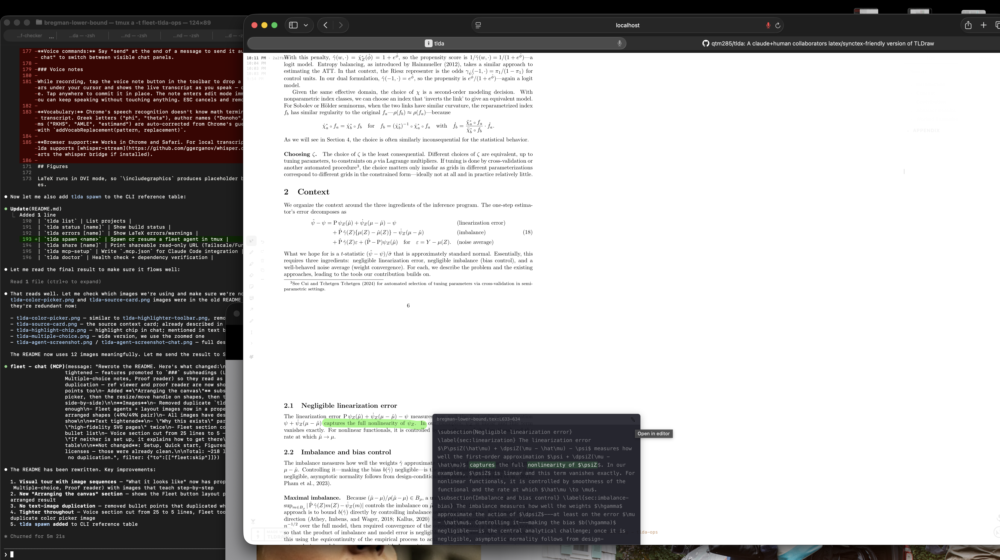

This works via a custom `texsync://` URL scheme. One-time setup:

```bash
tlda setup editor                  # Zed (default)
tlda setup editor --editor code    # VS Code
tlda setup editor --editor cursor  # Cursor
tlda setup editor --editor nvim    # Neovim
```

This builds a lightweight macOS app (`~/Applications/texsync.app`) that routes `texsync://` URLs to your editor with the correct goto-line syntax. Supports Zed, VS Code/Cursor/Codium, Vim/Neovim, and Sublime.

## Version history

A small stack of build timestamps sits in the top-left corner of the canvas. The most recent build is at the top; up to five recent versions are shown, fading out toward the bottom.

Click any older timestamp to open a history column to the right of your document — the paper as it was at that build, side by side with the current version. A slider appears at the bottom of the screen to scrub through your full build history.


A gray divider bar appears between the two columns. Drag it left or right to move the columns closer together; drag it up or down to vertically align the text between them.

Click the current (top) timestamp to dismiss the history column.

### How it works: the shadow repo

Every successful build is automatically committed to a per-project git repository (the "shadow repo") at `server/projects/{name}/shadow-repo/`. This is internal to tlda — nobody should touch it directly. Each commit captures the source snapshot at that build, so the full history of your document is preserved regardless of your own git habits.

The version history UI reads from the shadow repo. When you click an older timestamp, tlda checks out that commit's SVGs and shows them side by side with the current version.

Chat messages in fleet are tagged with the shadow version you're viewing, so agents always know which version of the document you're looking at.

**Mirroring** (optional): on the project's index page, you can enable mirroring to have each successful build automatically synced to your working copy. When enabled, tlda fetches the shadow commit, stashes your local changes, checks out the shadow state on a `tlda-shadow/main` branch, commits, and unstashes — so your working copy always has a git history of every build. Shadow versions are tagged in your repo, making it easy to map between shadow versions and your own commits.

## Voice input

Dictate into chat instead of typing. **Right Shift** toggles recording on/off. Say "send" to dispatch the message. Say "right chat" or "left chat" to switch between chat panels.

Uses [whisper-stream](https://github.com/ggerganov/whisper.cpp) for local transcription (auto-starts with `tlda server start`), falling back to Chrome's Web Speech API. Domain-specific vocabulary — Greek letters, author names, math terms — is auto-corrected. Add custom replacements with `addVocabReplacement(pattern, replacement)`.

**Voice notes:** While recording, tap the voice note button in the toolbar to drop a note on the canvas. The note shows the live transcript as you speak — drag to position, tap to commit. The note stays in edit mode so you can keep speaking.

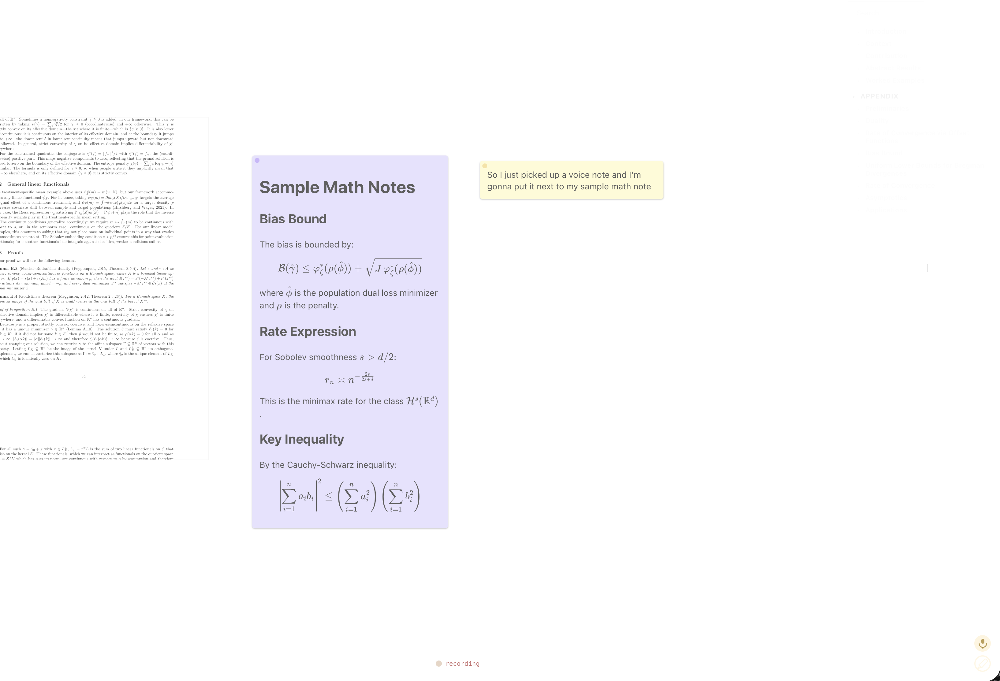 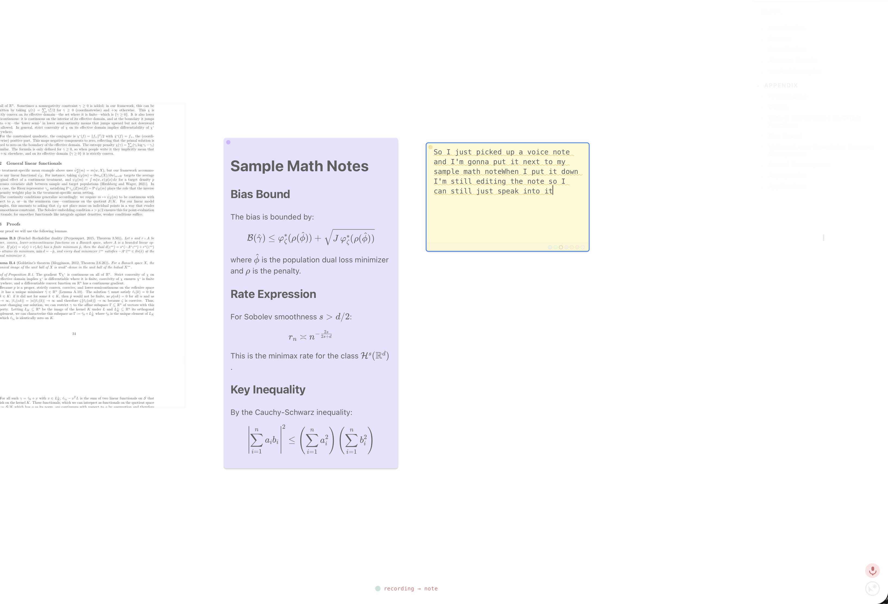
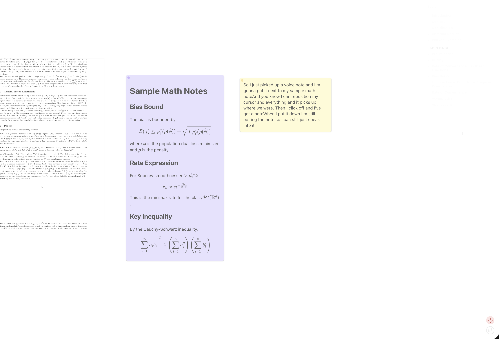

## Figures

LaTeX runs in DVI mode, so `\includegraphics` produces placeholder boxes that get patched with actual images.

**Supported:** `.svg` (preferred), `.png`, `.jpg`, `.eps`

**For PDF figures:** provide an SVG with the same basename and dimensions. If your LaTeX says `\includegraphics{plot.pdf}`, the pipeline uses `plot.svg` instead.

## Multi-document projects

If your project uses the `xr` or `xr-hyper` package to cross-reference a companion document (e.g. a supplement), the build pipeline detects `\externaldocument{X}` in your main file and automatically builds `X.tex` as a second target. Both documents share the same project — their pages appear together on the canvas and the viewer shows both in sequence.

No configuration is needed: add `\usepackage{xr}` and `\externaldocument{supplement}` to your main file, include `supplement.tex` in your source directory, and both will be compiled and displayed.

Cross-references between the documents resolve normally. tlda builds the referenced document first so `.aux` files are in place for the main compilation.

## Writing linters

On every build, tlda scans the diff (new lines only — not existing text) for three classes of issues and posts findings to fleet chat:

- **Typography** (🔴) — punctuation errors like comma before a conjunction in display math, missing space before units, etc. Checked via a grammar model.
- **Parenthetical overuse** (🟡) — sentences that add a new parenthetical aside. Parentheticals interrupt the reader; use footnotes or restructure instead.
- **Passive voice** (🟡) — new passive constructions. Sometimes unavoidable, but the lint surfaces them so you can decide.

Findings are diff-scoped: only new text in this build is checked. Existing text is never flagged, so you won't be flooded on a first build.

## CLI reference

| Command | What it does |
|---------|-------------|
| `tlda config init` | Generate auth tokens (run once) |
| `tlda server start` | Start the server (port 5176) |
| `tlda server stop` | Stop the server |
| `tlda create <name> --dir /path` | Create a project, push files, build |
| `tlda push [name]` | Push source files, trigger rebuild |
| `tlda watch-all start` | Watch all projects for changes, auto-rebuild on save |
| `tlda open [name]` | Open viewer for a doc; omit name to open the index |
| `tlda list` | List projects |
| `tlda status [name]` | Show build status |
| `tlda errors [name]` | Show LaTeX errors/warnings |
| `tlda spawn <name>` | Spawn or resume a fleet agent in tmux |
| `tlda setup editor` | Install editor integration (Cmd-click → open source) |
| `tlda share [name]` | Print shareable read-only URL (Tailscale/Funnel aware) |
| `tlda mcp-setup` | Write `.mcp.json` for Claude Code integration |
| `tlda doctor` | Health check + dependency verification |
| `tlda config set <key> <val>` | Persistent configuration |
| `tlda delete <name>` | Delete a project |

Configure with `tlda config set server <url>` or the `TLDA_SERVER` environment variable.

## Other formats

LaTeX is the primary format. tlda also supports:

| Format | Command |
|--------|---------|
| **Markdown** | `tlda create notes --format markdown --dir /path` |
| **HTML** (Quarto) | `tlda create book --format html --dir _book-tlda` |
| **Slides** (reveal.js) | `tlda create deck --format slides --dir /path` |

## Third-party licenses

This project uses the [tldraw SDK](https://tldraw.dev) under the [tldraw license](https://tldraw.dev/legal/tldraw-license). The viewer works fine on `localhost` — local use and collaboration over Tailscale/LAN are unaffected. For public deployments, you'll need a [tldraw license key](https://tldraw.dev/get-a-license/plans) (free hobby tier available).

## License

[MIT](LICENSE)
