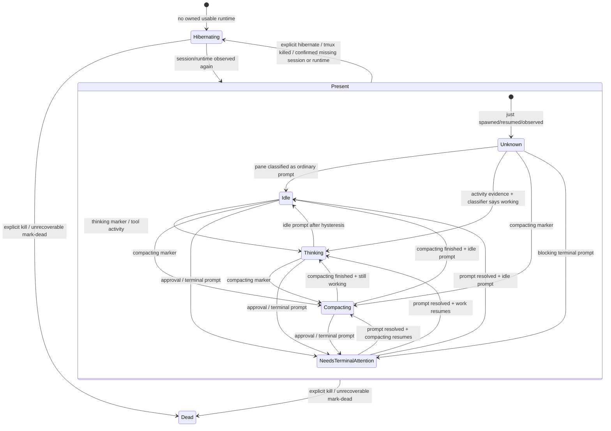

# Light Daemon Status State Machine

This is the maintained status contract for the light fleet daemon.

The key rule is that liveness and activity are separate layers. Liveness says
whether the daemon has a usable owned runtime. Activity says what that runtime is
doing. `present` is therefore not a user-facing status; it is the container in
which the activity state is classified.

## Vocabulary

Liveness layer:

- `present`: internal liveness fact; an owned tmux session/runtime exists. This
  is not a display status.
- `hibernating`: the agent exists and is resumable/known, but no usable owned
  runtime is currently present.
- `dead`: intentionally killed, explicitly marked dead, or unrecoverable.
- `unknown`: the daemon cannot safely determine local truth. This must not
  trigger destructive hibernation.

Activity layer while `present`:

- `idle`: runtime exists and is at an ordinary prompt, not doing anything else.
- `thinking`: classifier or harness event says the agent is actively working.
- `compacting`: classifier or harness event says the agent is compacting.
- `needs_terminal_attention`: internal code label for a live session blocked on
  a terminal/user/operator prompt. User-facing label: `needs help`.

Avoid `awake` as a steady display status. If the daemon observes a hibernating
agent's session again, the liveness event is `present`/`resumed`; the display
should settle immediately into the activity state, usually `idle`.

Avoid `waking` unless the system is actually performing a transient wake
operation. Most daemon evidence is observational: "the session exists again."

The existing public roster/filter bucket is still named `awake`. That bucket is
computed by the server's liveness oracle and is deliberately separate from the
daemon activity status described here. Renaming that public bucket is a UI/filter
migration; this daemon spec only requires that `awake` not be used as the
steady activity/display state.

## Transition Causes

### Spawn

| From | Cause | To | Notes |
| --- | --- | --- | --- |
| none or `hibernating` | owning daemon accepts spawn | `present.unknown` | local launch is in progress or just produced a session |
| `present.unknown` | usable tmux/session and resume handle exist | activity state | classify as `idle`, `thinking`, `compacting`, or `needs_terminal_attention` |
| `present.unknown` | launch fails | prior stable state or `hibernating` | emit failed-spawn alert |
| `present.unknown` | Codex session has no durable resume handle | prior stable state or `hibernating` | handle-less Codex spawn is a failure |

### Resume

| From | Cause | To | Notes |
| --- | --- | --- | --- |
| `hibernating` | owning daemon accepts resume | `present.unknown` | resume is a launch attempt |
| `present.unknown` | usable resumed process exists | activity state | durable resume handle remains owned |
| `present.unknown` | resume fails | `hibernating` | emit failed-resume alert to the requester |

### Activity

| From | Cause | To | Notes |
| --- | --- | --- | --- |
| `idle` | owned JSONL/sqlite/activity event arms session | `thinking` or `idle` | detailed pane check is event-armed; classifier decides |
| `hibernating` | owned live-session activity is observed | `present.unknown` | only if ownership and session truth are valid |
| any | unowned watcher/tailer/RPC activity | no transition | ignore or emit ownership diagnostic |

### Thinking And Compacting

| From | Cause | To | Notes |
| --- | --- | --- | --- |
| `idle` or `unknown` | classifier says thinking | `thinking` | emit thinking edge |
| `thinking` | idle prompt after hysteresis | `idle` | emit thinking false edge |
| `idle`, `thinking`, or `unknown` | classifier says compacting | `compacting` | emit compacting edge |
| `compacting` | compacting marker clears | `idle` or `thinking` | next state depends on fresh classifier evidence |

### Terminal Attention

| From | Cause | To | Notes |
| --- | --- | --- | --- |
| `idle`, `thinking`, `compacting`, or `unknown` | approval, login, or blocking terminal prompt | `needs_terminal_attention` | display label: `needs help` |
| `needs_terminal_attention` | prompt resolved and runtime alive | `idle`, `thinking`, or `compacting` | next state depends on fresh classifier evidence |
| `needs_terminal_attention` | session/runtime disappears past grace | `hibernating` | cleanup thinking/compacting edges as needed |

### Session Or Runtime Disappearance

| From | Cause | To | Notes |
| --- | --- | --- | --- |
| any present activity state | one missing session/runtime probe | same state with missing-since marker | first miss starts grace; no destructive transition |
| any present activity state | confirmed missing session/runtime past grace | `hibernating` | process disappeared, but agent is still resumable |
| any state | daemon/server disconnect | `unknown` or preserved prior state | disconnect does not consume hibernation grace |

### Explicit Hibernate And Kill

| From | Cause | To | Notes |
| --- | --- | --- | --- |
| any non-dead state | explicit hibernate action or tmux-session kill-as-hibernate | `hibernating` | session is gone, identity/history remain recoverable |
| any state | explicit kill action / mark-dead | `dead` | not inferred from ordinary missing-session evidence |

Implementation must not infer hibernate versus kill from the same generic
"session disappeared" signal. The explicit action label determines that
transition.

## Output Contract

The daemon emits scoped status edges for daemon-owned agents only.

- Liveness edges: `hibernating`, `present`, `dead`, `unknown`.
- Activity edges: `idle`, `thinking`, `compacting`,
  `needs_terminal_attention`.
- Alerts: failed spawn, failed resume, crash diagnostics, repeated probe
  diagnostics, ownership conflict diagnostics.

Server roster status may still expose `awake` as the public liveness/filter
bucket for a present non-human agent. That is not the daemon's activity state.

Clients render server-maintained state. They do not reconstruct daemon truth from
raw roster scans.

## Performance Contract

Idle steady state:

- no pane captures for unarmed agents;
- no transcript tree scans;
- no whole-fleet process-tree reconstruction;
- no per-render or per-event whole-roster client scans.

Active steady state:

- pane scans are limited to armed owned agents;
- JSONL parsing happens in the stream-tail child;
- source, backing-file, and scratch symlink file watching uses chokidar;
- owner harvesting/backfill stays out of the status hot path.
