# Source authority and linked-checkout synchronization

The server owns the accepted source revision. A linked checkout is a peer:
its daemon submits local changes against the last accepted revision and applies
accepted changes from other peers. There is no last-writer-wins fallback.

## Server authority

Each project authority is in exactly one of these states:

- `uninitialized`: no accepted source revision exists.
- `current(revision)`: `revision` is the accepted immutable snapshot.
- `reconciliation-required`: bootstrap found different server and submitted
  source, so neither is silently chosen.

```mermaid
stateDiagram-v2
    [*] --> uninitialized
    uninitialized --> current: bootstrap(null, matching or empty server source)
    uninitialized --> reconciliation_required: bootstrap(null, differing server source)
    current --> current: submit(expected = current)\naccept immutable snapshot
    current --> current: submit(expected != current)\nreject stale-base; authority unchanged
    reconciliation_required --> reconciliation_required: ordinary submit rejected
```

The compare-and-set rule is the whole server decision: a mutation is accepted
only when its `expectedRevision` equals the current revision. A stale submission
does not mutate authority. It receives the current revision plus per-file
three-way classifications derived from its base, current, and incoming
snapshots.

Project source operations are serialized per project before this rule runs.
After an accepted mutation, the server durably sends that exact accepted
revision and changed bytes to every connected daemon except the daemon that
originated it. A daemon that does not own a linked checkout declines with
`project-not-watched`.

## Outbound linked-checkout changes

For each linked project, the daemon tracks one accepted revision and permits one
source submission in flight. Additional local filesystem changes are merged
into one queued payload.

```mermaid
stateDiagram-v2
    [*] --> idle
    idle --> in_flight: local change\nsubmit(expected = accepted revision)
    in_flight --> queued: another local change
    in_flight --> idle: accepted\nadvance accepted revision
    queued --> in_flight: accepted\nadvance revision; submit merged queue
    in_flight --> retrying: first stale-base\nlearn current revision; retry once
    retrying --> blocked: second stale-base
    retrying --> idle: conflict markers written locally\nwait for human save
    blocked --> idle: authoritative project sync supplies a new revision
    in_flight --> queued: connection lost\nmerge unknown request into queue
    queued --> in_flight: reconnect + authoritative revision seed
```

The retry is bounded to one stale-base response. If the server supplied a
textual merge conflict, the daemon writes those markers into the linked
checkout and stops deciding. The person's next save is a new ordinary
submission. A second stale-base without a writable conflict blocks automatic
submission until an authoritative project sync changes the known revision.

## Applying an accepted remote revision locally

The local decision is per changed path. Let:

- `baseline` be the fingerprint recorded when the watcher last knew the path
  was synchronized;
- `pending` mean the watcher has observed a local edit that has not yet been
  submitted;
- `drifted` mean the current filesystem fingerprint differs from `baseline`;
- `same` mean the current bytes already equal the accepted remote bytes.

| Local condition | Text file | Binary file |
| --- | --- | --- |
| `same` | Leave unchanged | Leave unchanged |
| neither `pending` nor `drifted` | Apply accepted bytes | Apply accepted bytes |
| `pending` or `drifted` | Write local/remote conflict markers | Refuse and emit a critical warning |

Deletion uses the same rule: an unchanged path is deleted; a pending or drifted
text path receives local content versus an empty remote side; a binary delete
conflict is refused and surfaced.

`pending` and `drifted` are deliberately independent. A filesystem watcher
updates its recorded fingerprint when it observes an edit, so checking only
fingerprint drift can misclassify that observed-but-not-yet-submitted edit as a
clean baseline. The pending set preserves that state until submission.

Writes made by an accepted remote update are marked `remoteApplied`; the watcher
consumes that marker instead of echoing the same bytes back to the server.
After a successful apply, the daemon advances to the accepted `sourceRevision`.

## Executable checks

The implementation is checked at the same boundaries:

- `bin/source-lifecycle-authority-test.mjs`: authority bootstrap,
  compare-and-set acceptance, stale-base evidence, and
  reconciliation-required.
- `bin/source-change-correlation-test.mjs`: one in-flight submission, queue
  merging, bounded retry, blocking, and reconnect behavior.
- `bin/source-conflict-delivery-test.mjs`: stale-base conflicts are written into
  the linked checkout and automatic retry stops.
- `bin/source-server-update-apply-test.mjs`: a clean accepted server edit reaches
  a linked checkout, while a watcher-observed pending local edit produces
  conflict markers instead of being overwritten.

The live acceptance gate is the same final transition: start from one accepted
revision, pause the owning daemon, make divergent local and server edits, then
resume it. The linked checkout must contain both sides as conflict markers.
