# Source authority and linked-checkout synchronization

The server owns the accepted source revision. A linked checkout is a peer:
its daemon submits local changes against the last accepted revision and applies
accepted changes from other peers. There is no last-writer-wins fallback.

## Server authority

Each project authority is in exactly one of these states:

- `uninitialized`: no accepted source revision exists.
- `current(revision)`: `revision` is the accepted immutable snapshot.
- `reconciliation-required`: bootstrap found different server and submitted
  source, so neither is silently chosen.

```mermaid
stateDiagram-v2
    [*] --> uninitialized
    uninitialized --> current: bootstrap(null, matching or empty server source)
    uninitialized --> reconciliation_required: bootstrap(null, differing server source)
    current --> current: submit(expected = current)\naccept immutable snapshot
    current --> current: submit(expected != current)\nreject stale-base; authority unchanged
    reconciliation_required --> reconciliation_required: ordinary submit rejected
```

The compare-and-set rule is the whole server decision: a mutation is accepted
only when its `expectedRevision` equals the current revision. A stale submission
does not mutate authority. It receives the current revision plus per-file
three-way classifications derived from its base, current, and incoming
snapshots.

Project source operations are serialized per project before this rule runs.
After an accepted mutation, the server durably sends that exact accepted
revision and changed bytes to every connected daemon except the daemon that
originated it. A daemon that does not own a linked checkout declines with
`project-not-watched`.

## Outbound linked-checkout changes

For each linked project, the daemon tracks one accepted revision and permits one
source submission in flight. Additional local filesystem changes are merged
into one queued payload.

```mermaid
stateDiagram-v2
    [*] --> idle
    idle --> in_flight: local change\nsubmit(expected = accepted revision)
    in_flight --> queued: another local change
    in_flight --> idle: accepted\nadvance accepted revision
    queued --> in_flight: accepted\nadvance revision; submit merged queue
    in_flight --> retrying: first stale-base\nlearn current revision; retry once
    retrying --> blocked: second stale-base
    retrying --> idle: conflict markers written locally\nwait for human save
    blocked --> idle: authoritative project sync supplies a new revision
    in_flight --> queued: connection lost\nmerge unknown request into queue
    queued --> in_flight: reconnect + authoritative revision seed
```

The retry is bounded to one stale-base response. If the server supplied a
textual merge conflict, the daemon writes those markers into the linked
checkout and stops deciding. The person's next save is a new ordinary
submission. A second stale-base without a writable conflict blocks automatic
submission until an authoritative project sync changes the known revision.

Known follow-up: non-conflict source-change rejections now surface as critical
daemon warnings, but the warning goes to the server owner and not to whoever
made the push that was rejected. So the person who can fix it is the one person
not told.

The ownership shape it was waiting on has since landed, and the remaining work
is smaller than "route it to the owner" sounds — but not as small, and the
recipient is the part to get right rather than the plumbing:

- **Notify the actor, not the machine.** A push carries `editedBy`, which is a
  fleet agent id: the daemon resolves it through `resolveEditor`, which returns
  the agent whose session touched the file. That is one recipient and it is the
  right one.
- **Do not fan out by daemon key.** `getAgentsByDaemonKey` exists and is the
  tempting route, but a daemon serves many agents, so that turns one person's
  rejected push into a broadcast to everyone seated on their machine.
- **The warning does not carry the actor yet.** `daemon-warning` is sent from
  `handleSourceChangeResult`, which sees the server's response rather than the
  push that caused it, so `editedBy` has to be threaded back through the
  correlation that holds the in-flight payload. That is the actual work, and it
  is a change to a delivery path rather than a one-line recipient edit.

Whoever takes it: this is a change to who receives a notification, which is
closer to a product decision than a sync fix, so it wants a judgement before it
lands rather than after.

A second gap in the same family was found on a real paper rather than in a
fixture: **a stale-base refusal with no textual conflict recorded nothing.**
Conflict state is written from the classifications that came back as `conflict`
— files with marker text in them. A refusal where nothing produced markers (a
binary both sides replaced, or any refusal the rebase could not settle) left
`sourceSyncConflicts` empty, so the pill stayed quiet and the paper looked fine.
The person who pushed learned by their HTTP status; nobody else learned at all.
Measured on 2026-08-13: a participant holding a stale revision edited a
bibliography nobody had touched, was refused, and the project's conflict state
stayed empty.

**The record now exists. What is shown has not changed.** A refusal with no
conflict files is written to `sourceSyncRefusals` by the push route, and
`sourceSyncLedger` reads both fields. Three things about its shape:

- **It is per person, not per file.** Being stuck is a fact about a participant
  whose machine cannot reach the paper, so repeated refusals collapse to one row
  keeping the *first* timestamp — the age that matters is how long they have
  been stuck rather than when they last retried. Any accepted push from them
  clears it.
- **It can name no file and still be a row.** A conflict without a file is
  nothing; a refusal without one is still somebody outside the paper.
- **It is deliberately not `sourceSyncConflicts`.** That field is what the
  conflict pill reads, and what a person is shown is a product decision rather
  than a sync one. Deciding to surface these is a separate change with a
  separate judgement.

`bin/a-refusal-that-left-no-trace-test.mjs` is the story, and it crosses the
push route because the recording is something the route does with what the
lifecycle refused — calling both halves from one process would prove both halves
and nothing about whether a refusal reaches the record.

### A failed checkpoint leaves the editor room holding the text

The same family, one layer up. When a source room's checkpoint fails for a
reason that is *not* a conflict — the server busy, the store closed, anything
that is not somebody else's edit — `flushRoom` sets `room.queued` and schedules
nothing. The flush timer is armed by a local edit and by the tail of a
successful push, and a failure is neither, **so the text sits in the room until
somebody happens to type again.**

Everyone with that file open sees an `error` status. Nobody else sees anything,
and the text has not reached the authority, so it is losable in the sense that
matters here: a server restart takes it.

The room now records that it is holding an edit, per file, and clears it on the
next successful checkpoint. **It does not retry**, deliberately — this domain is
detection rather than prevention, and adding a retry loop to a push path is a
behaviour change that wants deciding on its own rather than smuggled in behind
an instrument. Whoever picks that up: the room already pushes its whole text
rather than the failed edit, so a later successful checkpoint carries the held
paragraph in by itself. That is what the story asserts.

The recorders reach the room by injection (`recordHeldEdit`, `clearHeldEdit`)
like everything else that file touches. That is not ceremony: the room tests
stand up their own project store, so a direct import would write these into a
different store than the one under test and report nothing while looking wired.

The story is the third section of `bin/an-edit-that-reached-nowhere-test.mjs`,
which is also where the checkpoint window itself is measured.

### Something has to look at the clock

Both records above are written when the failure happens. **Neither writes
anything at the moment it becomes old**, and the alarm here is age, so a ledger
with no sweep is a data structure rather than an instrument.

`staleSourceSyncEntries` is that sweep, kept pure, ordered oldest first across
every project — the question a person asks is *what is worst*, not *what is
where*. The server runs it on a timer (`TLDA_SOURCE_SYNC_SWEEP_MS`, five
minutes; `TLDA_SOURCE_SYNC_STUCK_MS`, thirty) off one `listProjects()` call
rather than a file read per project, logs `[source-sync-stuck]` with a sentence
per entry, and records a `source-sync-stuck` perf event.

Three things about it are deliberate:

- **It speaks when the set changes, not every five minutes.** A line repeated
  until somebody mutes it is a line nobody reads. It also says so when the last
  thing clears, because silence that means "fixed" and silence that means
  "nothing ran" are otherwise the same.
- **An entry younger than the threshold is not news**, but one with **no
  readable age always is** — the thing nobody can say is fine must not be
  averaged in with the thing that is.
- **A failing sweep logs and continues.** An instrument must never be what takes
  the server down.

`bin/a-refusal-that-left-no-trace-test.mjs` runs the sweep through
`listProjects()`, the same call the timer makes, because a field that did not
survive the store read would leave it reporting an empty fleet forever while
every assertion against a hand-built project object still passed.

**What the sweep still cannot see, and why it is a bigger piece than it sounds.**
Both entries above start from something the server watched happen. The third
losable state does not: **a linked checkout with local edits that has simply
stopped pushing** — the daemon quiet, asleep, offline, or never having tried.
Nothing was refused, so nothing was recorded, and the sweep reports the paper as
clean.

The server cannot compute this. A daemon being behind the current revision is
ordinary and harmless on its own; it is only losable when that checkout **also
holds unsubmitted local edits**, and the pending set is knowledge the daemon has
and the server does not. So closing it is not another read over project state —
it needs the daemon to report *"I am holding N changes, the oldest since T"*,
a receive path for that, and the ledger merging it with what is already there.

Three things to get right, for whoever takes it:

- **The daemon reports, the server records.** Per §"The server reports daemon
  facts; it does not own daemon state" — the server must not model which
  checkouts exist or infer staleness from silence.
- **Silence is the case that matters, and a report cannot cover it.** A daemon
  that never speaks is exactly the daemon whose laptop is closed. So the record
  has to age the *last* report rather than wait for the next one, which is the
  same rule as everything else here: an instrument that only knows what it was
  told must not read absence as health.
- **It ships on a different clock.** The daemon half is deployed by restart from
  the shared checkout, not by a server deploy, so the two halves are live at
  different times and each has to behave alone.

## Applying an accepted remote revision locally

The local decision is per changed path. Let:

- `baseline` be the fingerprint recorded when the watcher last knew the path
  was synchronized;
- `pending` mean the watcher has observed a local edit that has not yet been
  submitted;
- `drifted` mean the current filesystem fingerprint differs from `baseline`;
- `same` mean the current bytes already equal the accepted remote bytes.

| Local condition | Text file | Binary file |
| --- | --- | --- |
| `same` | Leave unchanged | Leave unchanged |
| neither `pending` nor `drifted` | Apply accepted bytes | Apply accepted bytes |
| `pending` or `drifted` | Write local/remote conflict markers | Refuse and emit a critical warning |

Deletion uses the same rule: an unchanged path is deleted; a pending or drifted
text path receives local content versus an empty remote side; a binary delete
conflict is refused and surfaced.

`pending` and `drifted` are deliberately independent. A filesystem watcher
updates its recorded fingerprint when it observes an edit, so checking only
fingerprint drift can misclassify that observed-but-not-yet-submitted edit as a
clean baseline. The pending set preserves that state until submission.

Writes made by an accepted remote update are marked `remoteApplied`; the watcher
consumes that marker instead of echoing the same bytes back to the server.
After a successful apply, the daemon advances to the accepted `sourceRevision`.

## Executable checks

The implementation is checked at the same boundaries:

- `bin/source-lifecycle-authority-test.mjs`: authority bootstrap,
  compare-and-set acceptance, stale-base evidence, and
  reconciliation-required.
- `bin/source-change-correlation-test.mjs`: one in-flight submission, queue
  merging, bounded retry, blocking, and reconnect behavior.
- `bin/source-conflict-delivery-test.mjs`: stale-base conflicts are written into
  the linked checkout and automatic retry stops.
- `bin/source-server-update-apply-test.mjs`: a clean accepted server edit reaches
  a linked checkout, while a watcher-observed pending local edit produces
  conflict markers instead of being overwritten.

The live acceptance gate is the same final transition: start from one accepted
revision, pause the owning daemon, make divergent local and server edits, then
resume it. The linked checkout must contain both sides as conflict markers.

## A push cannot carry a file larger than one request

`sourceFileBatches` bounds a push at 20 MiB of raw bytes. Two things about that
bound are not true, and a 488-file course book with 33 MB CSVs found both on
2026-08-12.

**The bound is in the wrong units.** The request body is base64 inside JSON, so
20 MiB of raw bytes leaves as roughly 27 MiB on the wire, against a server that
accepts `express.json({ limit: '50mb' })`. The bound and the limit measure
different things, so staying under the bound says nothing about staying under the
limit.

**And a file bigger than the bound cannot be batched at all.** The batcher starts
a new batch only when the current one is non-empty — correct, because a file
cannot be split — so a 33 MB file becomes a 33 MB batch and about 44 MB of body.
That is under the server's limit and above what it survives: the observed result
was a request timeout followed by the box being unreachable, health included.

So the bound works for the small files and is structurally unable to help with
the large ones. Whatever replaces it, three things have to be true rather than
one: the bound measures encoded bytes, a single oversized file has an answer that
is not "a batch of one", and a file the transport cannot carry is refused with a
sentence saying so rather than by taking the server down.

Until then, a project containing a file of that size cannot be pushed, and the
failure is a dead box rather than a rejection.
