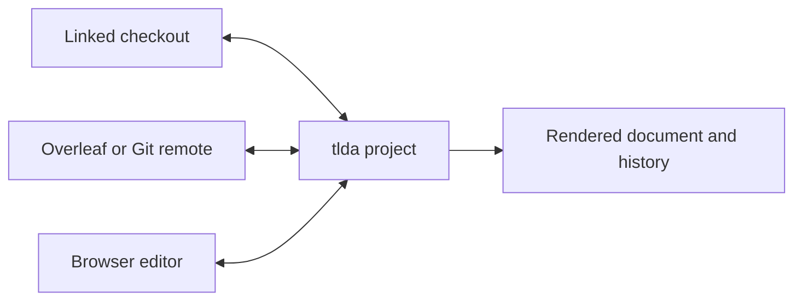
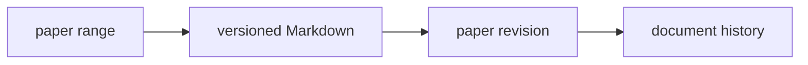

# Using tlda

This is the user reference after the first successful project open. It covers
identity, Markdown working documents, search, agents, and a full-strength local
setup. Exact command and tool arguments remain authoritative in `tlda --help`
and the running MCP schemas.

- [Identity, settings, editor, and voice](#identity-and-settings)
- [Project source, linking, and history](#project-source-linking-and-history)
- [Markdown documents](#markdown-documents)
- [Search and chat filters](#search-and-chat-filters)
- [Agents](#agents)
- [A full research setup](#a-full-research-setup)

## Identity and settings

Open settings from the gear tab beside the document’s table of contents and
notes. The same gear appears inside the document panel on a narrow screen.
Settings contains Account, Appearance, Voice, Input, and Bots.

Account chooses the identity collaborators and agents see:

- Entering a name in Account, or deliberately supplying `?name=`, stores that
  identity in the browser for later sessions.
- With no deliberate identity, tlda creates a temporary name for the browser
  session. A generated name never replaces an identity you chose.
- Ordinary preferences are stored for the active identity. Device names and
  readability profiles distinguish different devices using it.

This identity selection is not the server’s security boundary. A hosted server
still needs the authenticated network or proxy boundary described in
[Hosting tlda](hosting.md).

Set up source navigation once with:

```bash
tlda config setup editor
```

Zed is the default; the command also supports VS Code (`code`), Cursor,
VSCodium, Neovim, Vim, and Sublime Text. Voice is optional and explicitly
selected in settings; tlda does not silently substitute a different voice
backend.

The document’s lower-left status surface reports the state that can affect the
work: connection and source synchronization, builds, warnings or errors, and
collaboration presence. Treat an error there as part of the document, not as a
background log.

## Project source linking and history

You can link a local working copy, an Overleaf project, or another Git remote to
a tlda project. The source can be a LaTeX paper or a Markdown document. Local
editing, browser editing, and history then stay connected.



The intermediate server copy and shadow repository are implementation details;
you do not create or manage them separately.

Link a local checkout by passing its main file or repository root:

```sh
tlda project link eiv-paper /path/to/eiv-paper/least-squares.tex
```

The local path belongs only to this machine's daemon binding. The daemon watches
the checkout and sends revision-checked source transactions to the server.
For Markdown, pass the document itself. tlda infers the format from the `.md`
extension and includes the local Markdown files and assets it links to:

```sh
tlda project link proof-notes /path/to/notes/README.md
```

For Overleaf or another Git remote, pass its URL:

```sh
tlda project link eiv-paper https://git.overleaf.com/project-id \
  --main least-squares.tex \
  --token "$OVERLEAF_TOKEN" \
  --poll 60
```

The server owns the remote clone and polling. You may omit `--main` when the
project already has an entry file or the clone contains exactly one entry file.
Markdown format is inferred from a `.md` main file.

Linking the same project to the same source is an idempotent no-op. Linking it
to a different local path on one machine or a different Git URL fails without
changing the existing binding. Detach the exact source first:

```sh
tlda project unlink eiv-paper /path/to/eiv-paper/least-squares.tex
tlda project unlink eiv-paper https://git.overleaf.com/project-id
```

Local and browser edits submit through a revision-checked source transaction
boundary. The server polls and pushes a linked Git remote through its own clone,
so concurrent remote edits may require ordinary Git conflict resolution.
The server does not silently overwrite a linked local checkout with a browser
edit. The checkout discovers the newer server revision when it next submits and
then receives a merge conflict to resolve locally.

## Markdown documents

Markdown is a versioned document format in tlda. Use it for outlines, proof
development, proposed passages, research notes, or any other working document
that should retain its history and references.

### Ordinary Markdown

Headings, emphasis, lists, task lists, tables, links, images, block quotes, and
fenced code use ordinary Markdown:

```markdown
# A proof outline

- [x] Establish tightness
- [ ] Identify every subsequential limit

| object | role |
| --- | --- |
| $\hat\mu_n$ | estimator |
| $\mu$ | target |
```

### Mathematics

Inline mathematics uses `$...$`; display mathematics uses `$$...$$`.
Document macros are available when the Markdown project is configured with the
paper’s preamble.

```markdown
The estimator $\hat\mu_n$ satisfies

$$
\sqrt n(\hat\mu_n-\mu) \rightsquigarrow N(0,V).
$$
```

### Suggestions

A heading with the `.suggest` attribute turns the following list into choices
in chat or a note. Suggestions are decisions, not arbitrary executable actions.

```markdown
## Choose the next pass {.suggest}

- **Check the compactness step** — Re-read the only nonlocal argument
- **Rewrite the statement** — Keep the proof and repair the claim
- **Ask the proof checker** — Send the fuller instruction *check-proof*
```

The bold text is the chip label and the message sent when it is selected.
Following prose becomes the hover explanation. An optional italic phrase sends
that phrase instead of the label.

### Mermaid

A fenced `mermaid` block renders as editable tldraw shapes in the Markdown
document:

````markdown

````

### References and chat

Paper ranges, Markdown passages, messages, search results, images, and many
canvas objects can be dragged into a chat composer. A reference retains the
document and version it came from. Opening it returns to that place; dragging it
into another conversation carries the same context.

Markdown can also seed or open a filtered chat using the fleet filter syntax
below. Keep references as references rather than copying their displayed prose:
the link is what preserves provenance.

An agent can send a structural selection from a Markdown file without copying
it into an inline message:

```text
chat({
  to: "writer",
  file: "notes/outline.md",
  selector: "#identification"
})
```

`selector` uses CSS syntax over the Markdown structure. A heading id such as
`#identification` selects that heading and everything beneath it through the
next heading at the same or higher level. Classes and structural selectors work
too: `.app`, `h2`, and `.app > p` select a tagged section, every level-two
section, or the paragraphs directly inside an app section. A bare heading id is
accepted as shorthand for `#identification`. The same `file` and `selector`
form works in chat, delegation, and reports.

## Search and chat filters

Search combines literal text with scoped filters:

```text
from:skip "compactness"
agent:(chief | todd) since:2d
type:chat before:1d
skip <> writer
chief~2 "deployment"
```

Useful scopes:

- `from:`, `to:`, and `involving:` select conversation participants.
- `agent:` is another spelling of `involving:`.
- `since:` and `before:` bound time; `after:` is an alias for `since:`.
- `type:` and `role:` select event or message roles.
- `me` resolves to the current identity.
- `A <> B` means messages between `A` and `B`.
- Parenthesized agent expressions support `|`, `&`, and `!`, as in
  `agent:(chief | todd)` or `agent:(chief & !todd)`.

An agent lineage includes its successive holders:

- `chief~2` selects one lineage position.
- `chief~2..4` and `chief:2..4` select a range.
- `chief..4` selects through a position.

Adjacent scoped filters are combined. Keep boolean composition inside a scoped
agent value; the browser’s top-level boolean parser is not yet the same as the
MCP search grammar.

## Agents

The Fleet panel shows available agents and contains the mint control. Focusing
“mint a new agent” opens a staged picker for project, name, model, and
model-specific options. The current document is the default project. Minting
creates an agent; delegating gives an agent an obligation.

Agents may run through Claude Code, Codex, Goose, or another configured harness.
They present the same collaboration surface even when their underlying
capabilities differ. An idle agent hibernates; sending chat is the normal wake
mechanism.

## A full research setup

The smallest setup is intentionally small. A sustained research environment can
add named environments, project-local model and permission defaults, specialist
roles, lane guidance, skill gates, bots, editor and voice preferences, and
separate stable and testing worlds.

Skip’s setup has this shape:

```text
machine daemon configuration
├── environments
│   ├── stable
│   └── testing
├── permission profiles
│   ├── math
│   ├── app-dev
│   └── ops
├── model aliases and defaults
└── managed bots

project-local .tlda-daemon.yaml
└── project model and permission defaults

project guidance and global lane sources
├── historian
├── librarian
├── tester
├── operations
├── chief
└── optional advocate

qualification rules
└── tool/file skill gates
```

These are deliberately separate authorities:

- `~/.config/tlda/daemon.yaml` owns machine-wide environments, models,
  permissions, grants, and daemon behavior.
- A project’s `.tlda-daemon.yaml` deep-merges model and permission policy for
  agents minted inside that project. It may configure regions, permission
  profiles, grants, models, and the default profile. It cannot choose the
  project’s server environment.
- Project and lane guidance own roles and working instructions.
- Qualification rules own tool and file skill gates.
- Bot configuration owns managed bots and their responsibilities.

For example, tlda itself uses the project-local override:

```yaml
# .tlda-daemon.yaml
default: app-dev
```

That one line makes agents minted in this repository use the `app-dev`
permission profile from the machine configuration. A research-paper repository
might instead choose a math profile and a project-specific model alias:

```yaml
default: math
models:
  default: proof
  values:
    proof:
      id: <configured-proof-model>
      harness:
        kind: codex
        required:
          - --dangerously-bypass-approvals-and-sandbox
        preferences: []
        controls: false
      options:
        effort:
          default: medium
          values:
            low: {}
            medium: {}
            high: {}
```

Do not place tokens in YAML. Tokens live in `~/.config/tlda/tokens.json` or the
corresponding environment variables.

### Machine configuration

Local runtime configuration lives under `~/.config/tlda/`. The repository
ships examples in `config/`; the operator-owned file is
`~/.config/tlda/daemon.yaml`.

That file contains complete named environments under `environments:`. Select
one for a process with `TLDA_ENV=<name>` or for a CLI run with `--env <name>`.
`tlda daemon start --env <name>` carries the selection into agents it spawns.
Do not edit the shared default just to test another deployment.

The daemon configuration defines filesystem regions, permission profiles,
durable grants, model aliases and harness launch options, the tmux socket, and
task-document settings. Spawn-time model and profile resolution is re-read for
the next spawn. A malformed base or project configuration makes the next mint
fail. Use the profiles advertised by `tlda agent` instead of hard-coding their
names.

Regions name sets of paths. Profiles separately choose which regions an agent
may read and write. Grants assign a profile to an identity:

```yaml
regions:
  project:
    - cwd
  temp:
    - /tmp
    - /tmp/**

profiles:
  writer:
    read:
      allow: [project, temp]
      deny: []
    write:
      allow: [project, temp]
      deny: []

grants:
  fleet:alice: writer
```

An agent requests one configured profile when it is minted. The destination
daemon resolves and enforces that request. Unknown profile names refuse rather
than falling back to broader access. A project-local `.tlda-daemon.yaml` can
change the default profile or define project-specific profiles and models
without changing the selected server environment.

`TLDA_DAEMON_CONFIG_DIR` selects an isolated configuration directory for tests
and previews. It gives a sandbox daemon its own machine identity, pidfile,
database, and configuration. It does not make it safe to run two daemons
against the same environment.

`config/daemon-fenced.yaml` is the shipped constrained variant. It is not
automatically merged with `daemon.yaml`. Choose the intended configuration and
then inspect `tlda agent` help to confirm what the running CLI sees.

### Bots and CLI preferences

Managed bots live in `~/.config/tlda/bots.yaml`:

```yaml
bots:
  todd:
    script: /Users/you/work/tlda-bots/todd/todd.mjs
  teacher:
    script: /absolute/path/to/teacher-bot.mjs
    machine_id: mini
environments:
  testing:
    - todd
    - teacher
```

Each bot has a script and may select a machine. Optional environment values are
passed to its process. The `environments` map selects which bots run in each
named environment. Relative scripts resolve from the installed tlda root.

Manage their services with:

```bash
tlda bot list
tlda bot install [name]
tlda bot enlist [name]
tlda bot start [name]
tlda bot stop [name]
tlda bot status [name]
tlda bot log [name]
tlda bot uninstall [name]
```

The machine daemon does not start configured bots. On macOS these commands
manage each bot's launchd service, tmux session, log, and pid paths. A bot logs
in to the fleet like an agent.

Ordinary CLI preferences such as browser selection live in
`~/.config/tlda/cli.yaml`. Before changing local configuration, confirm the
active environment with `tlda system`, the daemon's status, the effective
profiles in `tlda agent` help, and bot resolution with `tlda bot list`. Keep
secrets out of daemon and bot YAML.

See [Current main architecture](current-main-architecture.md) for the system
boundaries. The
[permissions implementation contract](permissions-implementation-contract.md)
defines the internal resolution and persistence rules.
